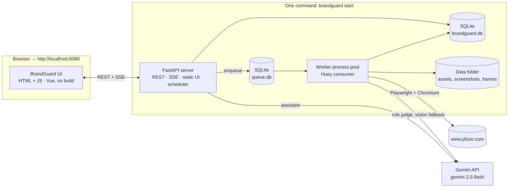

# Brand Compliance Review Platform — Solution Design (Draft v0.4)

> Status: **design iteration**, no code yet. Open questions are in [§13](#13-open-questions).
> Working name: **BrandGuard**.

## 0. Decision log

| # | Decision | Since |
|---|---|---|
| D1 | Open-source and free tools first; Python backend; HTML + JS frontend | v0.1 |
| D2 | AI = **Google Gemini**, **AI Studio API key**, **paid tier**, default model **`gemini-2.5-flash`**; all settings managed in the UI | v0.4 |
| D3 | Crawler = Playwright-based. **Crawlee vs Crawl4AI** are compared in the Phase 0 spike and the winner is picked on results. Browser MCP is not used for crawling | v0.4 |
| D4 | Multiple brands can be configured; start with **one brand: Pfizer** | v0.4 |
| D5 | **First target: `www.pfizer.com`**. First check: the brand name is spelled **"Pfizer"** everywhere | v0.4 |
| D6 | Multilingual (EN, ZH-Hans/Hant, JA, ES, DE, …), including **official non-Latin brand forms** | v0.3 |
| D7 | Every source of text is in scope: visible, **hidden**, **metadata**, images, documents, video (on-screen and spoken), audio. Visual brand rules (logo, color, font) come later | v0.3 |
| D8 | Hidden and metadata text **counts at full weight** in the compliance score | v0.4 |
| D9 | Out of scope: third-party embeds and anything behind a login | v0.2 |
| D10 | No triage workflow; read-only results with **evaluation and compliance dashboards** | v0.2 |
| D11 | Runs on **one laptop as a plain Python app, no Docker** | v0.4 |
| D12 | Because of D11: **SQLite** instead of PostgreSQL, **Huey (SQLite)** instead of a Postgres queue, frontend served by the Python server **with no Node build** | v0.4 |

> **Note on D12:** in v0.3 you agreed to drop Redis in favour of a Postgres queue.
> Without Docker, PostgreSQL would be a separate install and service on the laptop, so the same goal
> (fewest moving parts) is better met with **SQLite files** for both the data and the job queue.
> The code talks to the database through SQLAlchemy, so moving to PostgreSQL later is a settings change plus a migration.

---

## 1. Goal

For each configured **brand**, crawl its configured public websites and extract every asset and every piece of
text in any form. Evaluate all of it against the brand's rules (first rule: **brand name spelling**,
in every language), and present the results in compliance dashboards with evidence.

**First milestone:** crawl `www.pfizer.com` and report every place where the brand name is not
spelled exactly **"Pfizer"**, across page text, hidden text, metadata, images, PDFs and other documents.

---

## 2. High-level architecture (single laptop, no Docker)



### Pipeline (per run, per site)

```
Discover ─▶ Fetch & render ─▶ Classify ─▶ Extract ─▶ Detect language ─▶ Normalize ─▶ Evaluate ─▶ Score
(sitemap,    (DOM, screenshot,  (MIME,      (every     (per segment)       (per script)    (rules;     (dashboards,
 links)       same-domain        scanned?)  text                                            Gemini on   run diff)
              files)                        source)                                         ambiguous)
```

Each step is keyed by **content hash**, so re-runs only reprocess changed assets, and a rule change
re-evaluates the stored text without crawling again.

---

## 3. Configuration model

Everything is edited in the UI and can be imported/exported as **YAML** (plus a CSV/XLSX glossary for brand terms).
Each run records the config version it used.

```
Brand ─1:N─ Site
  ├──1:N─ BrandTerm (canonical form + per-locale/per-script forms)
  └──1:N─ RuleSet ─1:N─ Rule
```

### 3.1 Brand: Pfizer (starting config)

```yaml
brands:
  - id: pfizer
    name: Pfizer
    locales: [en]                        # add ja, zh-Hans, zh-Hant, es, de ... when country sites are added
    terms:
      - id: pfizer
        canonical: "Pfizer"
        case_sensitive: true             # "pfizer" and "PFIZER" in running text are violations (see Q1 on all caps)
        allowed_forms:
          - "Pfizer's"                   # possessive
          - "Pfizer Inc."
          - "Pfizer-BioNTech"            # approved co-brand
        allowed_compounds: ["PfizerPro", "PfizerForAll"]   # sub-brands written as one word (to be confirmed, Q2)
        disallowed: ["Phizer", "Pfiser", "Pfzer", "Pifzer", "Pfizzer", "Fizer", "P-fizer"]
        fuzzy: { max_edit_distance: 1, min_similarity: 0.83 }   # short word → tight threshold to avoid false hits
        exceptions: [urls, emails, social_handles, hashtags, file_names, stock_ticker]  # pfizer.com, @pfizer, #pfizer, PFE
        locales:                         # official non-Latin forms, used once country sites are in scope
          ja:      { approved: ["Pfizer", "ファイザー"],  disallowed: ["ファイザ", "ファイザ―"] }   # dash look-alike vs long-vowel mark
          zh-Hans: { approved: ["Pfizer", "辉瑞"],       disallowed: ["輝瑞"] }                   # Traditional form on a Simplified page
          zh-Hant: { approved: ["Pfizer", "輝瑞"],       disallowed: ["辉瑞"] }
    rule_sets: [brand-core]
```

### 3.2 Site: pfizer.com

```yaml
sites:
  - id: pfizer-com
    brand: pfizer
    start_urls: [https://www.pfizer.com/]
    use_sitemap: true
    allowed_domains: [www.pfizer.com, pfizer.com]   # add CDN/asset domains the site uses (Q3)
    exclude: ["\\?.*sort=", "/search\\?"]
    max_pages: 500                  # Phase 0 cap; remove later
    render_js: auto
    expand_interactive: true        # open accordions, tabs, carousels, "read more"
    politeness: { rps: 1, respect_robots: true, user_agent: "BrandGuard/0.1 (brand compliance review)" }
    schedule: null                  # manual runs to start with
```

### 3.3 Rule

```yaml
rule_sets:
  - id: brand-core
    rules:
      - id: BRAND-NAME-001
        type: brand_name
        terms: [pfizer]
        severity: high
        applies_to: [all]           # every asset type
        text_sources: [all]         # visible, hidden, metadata, image OCR, document, video, audio
        trademark: { require_symbol_on_first_use: false }   # off for Pfizer to start
        cross_locale: warning       # see §5.3
        llm_review: on_ambiguous    # off | on_ambiguous | always   (gemini-2.5-flash)
```

Rule types are plugins. `brand_name` is built first. Later: `forbidden_terms`, `required_text`,
`tone_of_voice` (LLM), `logo`, `color_palette`, `typography`.

---

## 4. Core data model

```
Brand ─ Site ─ Run ─ Asset ─ Segment ─ Finding ─ Rule
                       └─ parent_asset (image inside PDF, frame inside video, …)
```

| Entity | Key fields |
|---|---|
| **Asset** | url, page_url, mime, sha256, fetched_at, file_path, parent_asset_id, detected_languages, status (`ok` / `skipped` / `failed` + reason) |
| **Segment** | asset_id, text, **text_source**, **visibility** (`visible` / `hidden` / `metadata` / `spoken`), **render_transform** (e.g. CSS `uppercase`), language, script, locator, extractor + version, confidence |
| **Locator** | HTML: CSS selector + screenshot bbox · PDF/Office: page/slide + bbox · Image: bbox · Video: timestamp (+ bbox) · Audio: timestamp |
| **Finding** | rule_id/version, segment_id, matched_text, expected, severity, confidence, `new / persisting / fixed` vs previous run, `pending AI review` flag |

**Visibility** is set by the extractor:
- `visible`: rendered on screen, including content revealed by opening accordions, tabs and carousels
- `hidden`: in the DOM but not rendered (`display:none`, `visibility:hidden`, off-screen, zero size), `<noscript>`, hidden inputs
- `metadata`: `<title>`, `<meta>`, OpenGraph/Twitter, JSON-LD, document properties, EXIF/XMP/IPTC, ID3, PDF bookmarks and annotations
- `spoken`: speech-to-text from video or audio

**Source text vs rendered text:** a heading stored as "Pfizer" but styled with CSS `text-transform: uppercase`
*shows* as "PFIZER". We keep the **source text** for spelling checks and record the transform, so styling
doesn't produce false violations (see Q1).

No workflow state on findings. A **suppression list** (a rule exception or an allow-listed URL) is the only way
to silence a known false positive, and it is itself config.

---

## 5. Component design & tech options

Legend: ✅ recommended · ◻ alternative · ⚠ caveat

### 5.1 Crawling

**Chrome DevTools MCP / Playwright MCP** let an LLM drive a browser one step at a time. That's great for
interactive checks, but for bulk crawling it is slow, costly (each step is a Gemini call) and not repeatable.
Decision: crawl with **Playwright directly**; use a live-browser tool only inside the AI assistant (§5.4).

**Phase 0 spike: compare both crawlers on pfizer.com**

| | **Crawlee for Python** (Apache-2.0) | **Crawl4AI** (Apache-2.0) |
|---|---|---|
| Model | Crawling framework: request queue, retries, sessions, Playwright + HTTP crawlers | AI-oriented crawler: Playwright, deep-crawl strategies, Markdown output, media/link extraction |
| Strength | Full control of the page: run our own DOM walker, expand accordions, capture every file | Least code to get content; good defaults |
| Risk | More code to write | Its Markdown drops attributes, hidden text and metadata, so we still need our own DOM extraction hook |

**Scorecard** (measured on the same 500 pfizer.com pages): pages discovered · files found (PDF, images, Office, video) ·
text sources captured (visible / hidden / metadata) · runtime and CPU/RAM on the laptop · errors and blocks ·
lines of glue code · Windows/macOS install friction.
The **DOM extractor** (§5.2) is written once and plugged into both, so the comparison is fair.

**Crawler behaviour**
- Discovers pages from the sitemap and links, within `allowed_domains` only. Third-party iframes, embeds and assets on other domains are logged as *skipped – out of scope*
- Respects robots.txt and a low request rate, and identifies itself clearly in the User-Agent. **If the site's bot protection blocks the crawler, we report it and stop. No evasion techniques are used**
- Pages behind a login or returning 401/403 are skipped and logged
- For each page: DOM snapshot, full-page screenshot, and every linked or embedded same-domain file

### 5.2 Extraction — every kind of text

| Asset | Text sources extracted |
|---|---|
| **Web page** | visible text (including CSS `::before/::after`), headings, buttons, labels, placeholders, `alt`, `title`, `aria-*`, `<title>`, `<meta>`, OpenGraph/Twitter, JSON-LD, inline SVG text, canvas/CSS-background text (OCR of the screenshot), hidden text, content revealed by expanding accordions/tabs/carousels, link text; URLs and file names are logged for information only |
| **Image** | OCR text, SVG `<text>`, EXIF/XMP/IPTC (title, description, copyright) |
| **PDF** | text layer with positions; OCR for scanned or image-only pages; text in embedded images; properties (title, author, subject, keywords); bookmarks, annotations, form labels |
| **Word / PowerPoint / Excel** | body, headers/footers, tables, speaker notes, comments, slide titles, sheet names, cells, embedded images (OCR), properties |
| **Video** (same-domain) | spoken transcript, on-screen text (key-frame OCR), caption tracks (VTT/SRT), container metadata |
| **Audio** | spoken transcript, ID3 tags |

**Tools, chosen so everything installs with `pip`** (no Docker, few system dependencies):

| Need | ✅ Recommended (pip-installable) | Notes |
|---|---|---|
| Browser | **Playwright** + `playwright install chromium` | Chromium is downloaded into the user profile; no admin rights |
| Web page DOM text | Our own Playwright DOM walker + `trafilatura` (main-content flag) | |
| PDF, DOCX, PPTX, XLSX | **Docling** (MIT) | ◻ pypdfium2 / pdfplumber fast path for plain digital PDFs |
| OCR | **RapidOCR** (ONNX, PaddleOCR models, Apache-2.0): pure pip, multilingual incl. CJK | ◻ Tesseract only if the user installs it (optional) |
| Image metadata | Pillow + `python-xmp-toolkit`/Pillow XMP | no exiftool needed |
| Audio metadata | `mutagen` | |
| ffmpeg / ffprobe | **`static-ffmpeg`** pip package (downloads the binaries on first use) | no system install |
| Video key frames | PySceneDetect + `imagehash` | |
| Speech-to-text | **faster-whisper** (MIT), model `small` int8 on CPU | ◻ Gemini audio (§5.4) |
| Legacy `.doc/.ppt/.xls` | LibreOffice headless **if installed**, otherwise logged as *skipped – converter missing* | rare on modern sites |

### 5.3 Multilingual handling

| Concern | Approach |
|---|---|
| Language detection | **lingua-py**, per segment; URL locale hint as a starting guess |
| OCR for CJK | RapidOCR multilingual models (Chinese, Japanese, Latin) |
| Speech-to-text | Whisper is multilingual; brand terms (Pfizer, ファイザー, 辉瑞) passed as hotwords/prompt |
| Normalization | Unicode **NFKC** (full-width `Ｐｆｉｚｅｒ` → `Pfizer`), zero-width and soft-hyphen removal, Japanese long-vowel mark `ー` vs dash look-alikes, accents for ES/DE |
| Matching | Latin: tokens + **RapidFuzz**. CJK: direct character match (no spaces), optional jieba / SudachiPy for context |
| Simplified vs Traditional | **OpenCC** to detect 辉瑞 vs 輝瑞 on the wrong page |
| **Cross-locale check** | *What it means:* a brand form meant for one market appearing on another market's page, e.g. the Chinese name 辉瑞 on a Japanese page that should say ファイザー. Default: **warning (low severity)**. It doesn't apply to the English-only first run |

### 5.4 AI layer — Gemini (AI Studio key, paid tier)

Official **`google-genai` Python SDK** behind an `LLMProvider` interface (other providers stay possible later).
The **paid tier** gives higher rate limits, and Google does not use paid-tier prompts to improve its products.

| Use | Default model | When |
|---|---|---|
| **Rule judge** | `gemini-2.5-flash` | Only `ambiguous` findings (fuzzy near-misses, low OCR confidence); structured JSON `{verdict, reason, suggested_fix}`; cached by `(rule_version, segment_hash)` |
| **Vision/audio fallback** | `gemini-2.5-flash` | When local OCR/speech-to-text confidence is below a threshold, or for stylized text (e.g. the Pfizer wordmark in banners). Per asset type: `local` / `local + gemini fallback` (default) / `gemini` |
| **AI assistant** | `gemini-2.5-flash` | Chat with tool calling |
| **Embeddings** (Phase 2) | `gemini-embedding-001` | Semantic search for the assistant |

**Assistant tools** (Gemini function calling, each backed by our API): `search_findings`, `get_compliance_stats`,
`get_asset_evidence`, `explain_finding`, `draft_rule` / `draft_brand_term` (goes to the sandbox for the user to confirm),
`compare_runs`, `summarize_run`, and **`browse_live_page`**. This last one is a small built-in Python Playwright tool
that opens one page live. It needs no Node.js and no MCP server; Playwright MCP can still be connected later if Node is available.

**Gemini settings page**

| Setting | Default / notes |
|---|---|
| API key | Pasted once; stored in the **OS keychain** (`keyring`: Windows Credential Manager / macOS Keychain / Linux Secret Service); UI shows `••••1234` only; replace/remove buttons |
| Model per task | `gemini-2.5-flash` for judge, fallback and assistant; dropdowns filled from the live model list. A warning appears if a configured model disappears from the list (Google retires model versions over time) |
| Generation params | temperature 0.1 for judge, 0.4 for assistant; max output tokens; thinking budget (2.5 Flash supports it; low for judge); JSON mode for judge |
| Safety settings | Relaxed defaults (pharma terms such as dosage and side effects can trip filters) |
| Rate limits | **Paid-tier preset**, editable to match the quota page in AI Studio; limiter with backoff on `429`/`503` |
| Budget | Monthly spend cap; LLM steps pause (findings become `pending AI review`) instead of failing |
| Test connection | Sample prompt in EN/JA/ZH; shows latency, model and tokens |
| Usage panel | Calls, tokens and estimated cost per day, run, task and model |

### 5.5 Rule engine

1. **Deterministic tier** (every segment): normalize → exact match against allowed and disallowed forms →
   fuzzy near-miss (Latin) / character match (CJK) → exceptions (URLs, emails, @handles, #hashtags, file names, ticker) →
   result `violation` / `ok` / `ambiguous`, with confidence.
   Examples for Pfizer: `Phizer` ❌ · `pfizer` in a sentence ❌ · `pfizer.com` ⏭ exception · `Pfizer's` ✅ · `Pfizer-BioNTech` ✅ · `Pfzier` ⚠ fuzzy → judge.
   **Spoken** segments are checked for mention only, not spelling. Low-confidence OCR is marked `ambiguous`.
2. **Gemini tier:** only for `ambiguous` segments.
3. **Rule sandbox (UI):** paste text, upload a file or enter one URL, then see the results before saving a rule version.

### 5.6 Jobs & scheduling (no Redis, no Postgres)

- ✅ **Huey** (MIT) with its **SQLite** storage: task queue, retries and priorities in a local file. The worker runs as a child process of the app
- Queues: `crawl`, `extract`, `media`, `rules`, `llm`, each with its own concurrency (set by the performance profile)
- **Resumable:** jobs are stored on disk. After sleep, crash or restart, unfinished jobs continue, and idempotent steps make re-runs safe
- **Run controls:** pause, resume and cancel from the UI
- **Schedules** (later; manual runs first): **APScheduler** inside the app with a SQLite job store; missed runs while the laptop was off run once at next start (*coalesce*)
- Progress goes to the UI over **SSE**
- ◻ Alternative: no queue library at all, just a `jobs` table plus a Python process pool. Simpler, but we'd write retries and resume ourselves

### 5.7 Storage

- ✅ **SQLite** (WAL mode) via SQLAlchemy 2 + Alembic: config, runs, assets, segments, findings; **FTS5** for full-text search; **sqlite-vec** for vectors (Phase 2)
- ✅ **Data folder** `~/BrandGuard/data/` for downloaded files, screenshots, key frames, evidence crops
- Retention settings plus a disk-usage widget (e.g. keep raw videos only for the latest run)

### 5.8 Backend

- **FastAPI** + Pydantic v2 + Uvicorn; serves the API, SSE and the UI's static files from the same port
- **One command:** `brandguard start` starts the web server, the worker and the scheduler, and opens `http://localhost:8080` in the browser. Ctrl+C stops everything
- Local single-user mode: listens on `127.0.0.1` only; optional password

### 5.9 Frontend — HTML + JS, no build step

Vue 3 is a **JavaScript library**: you write HTML templates, CSS and plain JS, and the browser runs normal HTML/JS.
Because there is no Docker or Node on the laptop, we use Vue **without a build step**:

- `index.html` + ES-module `.js` files (one file per screen/component), served directly by FastAPI
- Libraries **vendored** into `frontend/vendor/` (downloaded once, committed), so it works offline without a CDN:
  **Vue 3** (ESM build), **PrimeVue** (tables, forms, tabs, dialogs), **Apache ECharts** (dashboards),
  **PDF.js** (PDF evidence), **Video.js** (seek to timestamp), **CodeMirror** prebuilt bundle (YAML editor), **markdown-it** (assistant)
- No `npm`, no bundler; edit a `.js` file and refresh the browser
- ◻ If the UI grows large later, the same Vue code can move to a Vite build with little change

### 5.10 Installation & running on the laptop

```
Requirements: Python 3.11+ · ~4 GB free disk (Chromium, OCR/Whisper models, Docling models) · 8 GB RAM minimum, 16 GB recommended
Install:      pip install brandguard        (or: uv tool install brandguard)
              brandguard setup              → downloads Chromium, OCR & Whisper models, ffmpeg; creates ~/BrandGuard/
Run:          brandguard start              → http://localhost:8080
```

| Performance profile | Browser pages | OCR/Docling workers | Speech-to-text | Use when |
|---|---|---|---|---|
| **Light** | 1 | 1 | Whisper `small`, 1 worker | you are working on the laptop |
| **Balanced** (default) | 2 | 2 | `small` | normal |
| **Max** | 4 | CPU cores − 2 | `medium` | overnight |

Backup: *Settings → Export* creates a zip with the config YAML, the SQLite database and the data folder. *Import* restores it.
Works on Windows, macOS and Linux (confirmed in the Phase 0 spike).

---

## 6. UX design

### 6.1 Navigation

```
┌────────────────────────────────────────────────────────────────────────────┐
│ ◆ BrandGuard  Overview  Compliance  Explorer  Runs  Sites  Rules  Settings [🤖]│
└────────────────────────────────────────────────────────────────────────────┘
```
A brand switcher appears once there is more than one brand.

### 6.2 Screens

| Screen | Purpose |
|---|---|
| **Overview** | Compliance score for Pfizer, assets evaluated, violations by severity, new vs fixed since last run, coverage (crawled / skipped / failed / blocked), latest runs |
| **Compliance dashboard** | Score trend; breakdowns by site, **visibility** (visible / hidden / metadata / spoken), **asset type**, **text source**, language, rule; top offending pages and files; **most frequent wrong spellings** (e.g. "pfizer" ×41, "Phizer" ×3). Every chart drills down |
| **Findings list** | Read-only grid with facets (site, visibility, asset type, text source, language, severity, confidence, new/persisting/fixed, pending AI review); CSV/XLSX export |
| **Evidence viewer** | Left: evidence in context (page screenshot with highlight, PDF page with box, image with box, video at timestamp, or **HTML/metadata snippet with DOM path** for hidden and metadata text). Right: found text, expected "Pfizer", rule, confidence, Gemini explanation, live URL |
| **Explorer** | Site → page → files; every extracted segment by source and visibility; skipped items and why |
| **Runs** | Start run (full / incremental / single URL / re-evaluate only); live progress per pipeline step; pause/resume/cancel; errors and logs |
| **Sites** | Add-site wizard: URL → sitemap detection → preview pages and file mix → scope → brand |
| **Rules** | Brand terms (allowed forms, sub-brands, disallowed misspellings, exceptions, per-locale forms), glossary import/export, rule form + YAML toggle, **sandbox** |
| **Settings** | Gemini (§5.4), performance profile, OCR/speech-to-text options, politeness, suppression list, retention and disk usage, export/import |
| **Assistant drawer** | Gemini chat aware of the current screen, e.g. *"Which PDFs spell Pfizer in lowercase?"* or *"Open this page live and check the footer"* |

### 6.3 Compliance scoring

- **Finding weight** = severity (high = 10, medium = 3, low = 1) × visibility factor. **All factors = 1.0** (visible, hidden, metadata, spoken count equally), editable in Settings
- **Asset score** = 100 − Σ finding weights (floor 0)
- **Site / brand score** = average asset score, shown with **% of assets with no high-severity violation**
- `pending AI review` findings are excluded until resolved and shown as a separate count

---

## 7. Pfizer — expected findings (illustrative)

| Source | Visibility | Text | Result |
|---|---|---|---|
| Page body | visible | "…at Phizer we believe…" | ❌ misspelling |
| `<meta name="description">` | metadata | "pfizer is a global…" | ❌ lowercase in running text |
| JSON-LD `"name"` | metadata | "Pfizer Inc." | ✅ allowed form |
| `display:none` promo block | hidden | "PFizer Oncology" | ❌ casing |
| Accordion (expanded by crawler) | visible | "Pfizer's pipeline" | ✅ |
| Link `href` | — | `https://www.pfizer.com/news` | ⏭ exception (URL) |
| Footer | visible | "@pfizer" / "#Pfizer" | ⏭ exception (handle / hashtag) |
| Heading with CSS uppercase | visible | source "Pfizer" → shows "PFIZER" | ✅ (source text correct, transform recorded) |
| PDF annual report p.12 | visible | "Pfizer-BioNTech" | ✅ co-brand |
| PDF properties → Author | metadata | "pfizer inc" | ❌ casing |
| Banner image OCR (0.61) | visible | "Pfzer" | ⚠ ambiguous → Gemini vision reads "Pfizer" → ✅ |
| Video 00:35 spoken | spoken | "at pfizer we…" | ℹ mention (spelling not checked) |
| YouTube iframe | — | — | ⏭ skipped (third-party) |

---

## 8. Non-functional

- **Politeness and legality:** robots.txt, 1 request/second by default, clear User-Agent, public pages only, no bot-protection evasion. Check that pfizer.com's terms of use allow automated review, or get the site owner's OK
- **Incremental:** ETag/Last-Modified + sha256; rule changes re-evaluate without re-crawling
- **Audit:** every finding records run, config version, rule version, extractor and model version
- **Safety:** sandboxed Chromium, file-size and decompression limits, Office macros never executed
- **Cost control:** Gemini only for ambiguous cases and fallbacks, caching, rate limiter, budget cap
- **Laptop-friendly:** CPU-only, performance profiles, resumable jobs, local-only network binding, retention limits

## 9. License watch-list

| Component | Issue | Mitigation |
|---|---|---|
| PyMuPDF | AGPL | Docling / pypdfium2 / pdfplumber |
| Firecrawl (self-hosted) | AGPL | Crawlee / Crawl4AI |
| Ultralytics YOLO | AGPL | Gemini vision / OpenCLIP for future logo rules |
| FFmpeg (via static-ffmpeg) | LGPL/GPL by build | Run as an external binary, not linked |
| Gemini API | Commercial paid service | Rate limiter + budget cap |

## 10. Tech stack summary

| Layer | Choice |
|---|---|
| Frontend | HTML + ES-module JS, Vue 3 (no build, vendored), PrimeVue, ECharts, PDF.js, Video.js, CodeMirror |
| Server | FastAPI + Uvicorn (API, SSE, static UI), one `brandguard start` command |
| Jobs | Huey (SQLite storage) + APScheduler |
| Data | SQLite (WAL, FTS5, sqlite-vec later) + local data folder |
| Crawl | Playwright (Chromium) with **Crawlee or Crawl4AI**, decided in Phase 0 |
| Extract | DOM walker, trafilatura, Docling, RapidOCR, Pillow, mutagen, static-ffmpeg, PySceneDetect, faster-whisper |
| Language | lingua-py, OpenCC, RapidFuzz, jieba / SudachiPy (optional) |
| AI | `google-genai`, AI Studio key (paid tier), `gemini-2.5-flash`; key stored in OS keychain |

## 11. Proposed repository layout (later)

```
brandguard/
  cli.py                 setup / start / export / import
  api/  core/  models/
  pipeline/{crawl/{crawlee_adapter,crawl4ai_adapter,dom_walker}, extract, lang, rules, score}
  ai/{gemini.py, ratelimit.py, assistant.py, tools.py}
  jobs/                  huey tasks, scheduler
frontend/
  index.html  app.js  screens/*.js  components/*.js  vendor/
config/examples/         pfizer.brand.yaml, pfizer-com.site.yaml, brand-core.rules.yaml
docs/
```

## 12. Roadmap

| Phase | Scope |
|---|---|
| **0 – Spike (pfizer.com)** | Up to 500 pages of www.pfizer.com; **Crawlee vs Crawl4AI** side by side with the shared DOM walker; web-page text (visible, hidden, metadata) + PDFs; "Pfizer" spelling rule; results to CSV plus a one-page HTML summary; measure laptop CPU/RAM/runtime; confirm Windows/macOS install |
| **1 – MVP** | UI (Overview, Compliance, Findings, Evidence, Runs, Sites, Rules, Settings); images + OCR; Office via Docling; Gemini settings + rule judge + vision fallback; CSV/XLSX export; full-site crawl |
| **2 – Media & Assistant** | Same-domain video/audio; AI assistant with tools and live-page check; schedules; run diffs; more Pfizer sites and languages (ja, zh, es, de) |
| **3 – Visual brand** | Logo, color and typography rules; tone-of-voice rules |

---

## 13. Open questions

Resolved in v0.4: paid tier with `gemini-2.5-flash` · no Docker · first target pfizer.com / "Pfizer" · hidden text at full weight · try both crawlers.

Still open:
1. **All caps:** is **"PFIZER"** written in capitals (in the source text, a PDF or an image) allowed, e.g. in headings or the logo, or always a violation? (CSS-uppercased headings are already treated as correct.)
2. **Sub-brands and co-brands:** which one-word or hyphenated forms are approved, e.g. *PfizerPro*, *PfizerForAll*, *Pfizer-BioNTech*? Is there an official list?
3. **Scope of pfizer.com:** only `www.pfizer.com`, or also its subdomains and file hosts (e.g. `cdn.pfizer.com`, `labeling.pfizer.com`, investor pages)? Labeling PDFs could add thousands of documents.
4. **Laptop OS:** Windows or macOS (Apple Silicon or Intel)? This affects install testing and default profiles.
5. **Authorization:** is the review being done by or for Pfizer (site owner OK to crawl), or is this an independent test? This decides how carefully we throttle and whether we need any sign-off.
