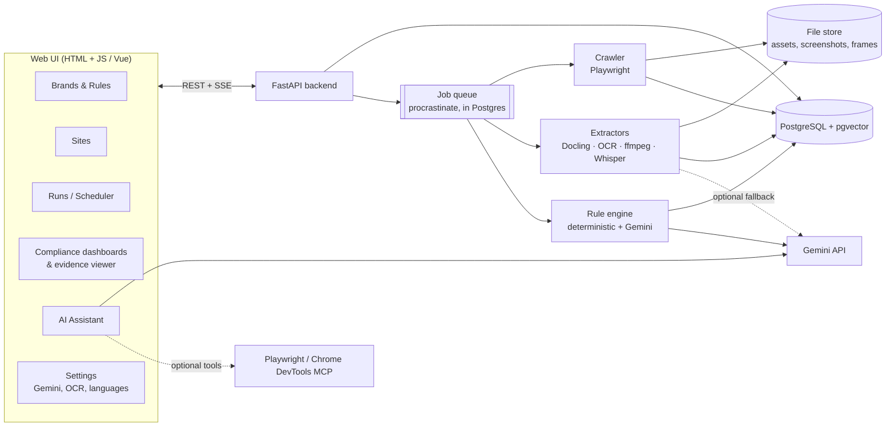

# Brand Compliance Review Platform — Solution Design (Draft v0.3)

> Status: **design iteration**, no code yet. Open questions are in [§13](#13-open-questions).

### Changes since v0.2 (decisions confirmed)

| Area | Decision |
|---|---|
| Gemini access | **AI Studio API key** only. Vertex AI is dropped from the design (it could be added later behind the same provider interface) |
| Brand names | **Non-Latin brand names are used officially** (e.g. Chinese and Japanese forms). Each brand term carries approved and disallowed forms **per locale and per script** as first-class config ([§3.1](#31-brands--sites--rule-sets)) |
| Hidden text & metadata | **In scope and counted in the compliance score**, with a *visibility* dimension so dashboards can split visible, hidden and metadata results ([§4](#4-core-data-model), [§6.3](#63-compliance-scoring)) |
| Scope | Every source of text now; visual brand rules (logo, color, font) in a later phase |
| Job queue | **Postgres-backed queue (procrastinate)**. Redis/Valkey is removed |
| Hosting | **Runs on a single laptop** with Docker Compose: CPU-only defaults, resource limits, catch-up of missed schedules, local-only access ([§5.10](#510-deployment--laptop)) |
| Local LLM | Ollama is removed from the default setup (too heavy for a laptop next to the pipeline). The provider interface keeps it possible |

### Changes in v0.2

| Area | Decision |
|---|---|
| AI | **Google Gemini** is the primary LLM, with all its settings managed in the UI. Local Ollama is still an optional provider |
| Crawling | Compared browser MCPs (Chrome DevTools MCP, Playwright MCP) and AI-native crawlers (Crawl4AI and others). Decision: crawl with Playwright directly; give the browser MCP to the AI assistant only ([§5.1](#51-crawling--is-there-a-modern-alternative-like-chrome-mcp)) |
| Scale | Not a concern: simplified deployment (fewer services) |
| Brands | Multiple brands can be configured; the first release ships with one |
| Languages | Multilingual: English, Chinese (Simplified and Traditional), Japanese, Spanish, German, and others via config |
| Content scope | **Every kind of content**: visible text, hidden text and metadata, text inside images, documents, videos and audio (on-screen and spoken), and non-text assets (logos, images) |
| Out of scope | Third-party embeds (YouTube, social media and so on) and anything behind a login |
| Results | **No triage workflow** (no assign or approve). Results are read-only, shown in **evaluation and compliance dashboards** with drill-down and export |
| Frontend | Explained how Vue relates to plain HTML and JS ([§5.9](#59-frontend--is-vue-the-same-as-html--js)) |

---

## 1. Goal

For each configured **brand**, crawl its configured public websites and extract every asset
and every piece of text in any form. Evaluate all of it against that brand's configurable rules
(the first rule is the **brand name**, in every configured language), and present the results
in compliance dashboards.

## 2. High-level architecture



### Pipeline (per run, per site)

```
Discover ─▶ Fetch & render ─▶ Classify ─▶ Extract ─▶ Detect language ─▶ Normalize ─▶ Evaluate ─▶ Score
(sitemap,    (page, screenshot, (MIME,      (all text   (per segment)       (per-language   (rules,     (dashboards,
 links,       same-domain       scanned?,   forms, see                      normalization)  Gemini on   run diff)
 assets)      assets)           language)   §5.2)                                           ambiguous)
```

Each step is keyed by **content hash**, so re-runs only reprocess changed assets. Changing a rule
re-evaluates the stored text without crawling the sites again.

---

## 3. Configuration model

Everything is edited in the UI and can be **imported/exported as YAML**. Each run records
the config version it used.

### 3.1 Brands → Sites → Rule sets

```
Brand ─1:N─ Site
  └──1:N─ RuleSet ─1:N─ Rule
  └──1:N─ BrandTerm (canonical name + per-locale forms)
```

```yaml
brands:
  - id: acme
    name: Acme
    locales: [en, zh-Hans, zh-Hant, ja, es, de]
    terms:
      - id: product-cloud
        canonical: "AcmeCloud"                 # global Latin form
        trademark_symbol: "®"
        disallowed_global: ["Acme Cloud", "Acme-Cloud", "ACMECLOUD", "Acmecloud"]
        locales:                               # official non-Latin forms are first-class
          ja:
            approved:   ["AcmeCloud", "アクメクラウド"]
            disallowed: ["アクメ・クラウド", "アクメ クラウド", "あくめくらうど"]   # middle dot, space, hiragana
            latin_allowed: true                # Latin form may also appear in Japanese text
          zh-Hans:
            approved:   ["AcmeCloud", "爱克云"]
            disallowed: ["爱克雲", "愛克云"]    # mixed Simplified/Traditional
          zh-Hant:
            approved:   ["AcmeCloud", "愛克雲"]
            disallowed: ["爱克云"]              # Simplified form on a Traditional page
          de: { approved: ["AcmeCloud"], allow_compounds: true }   # "AcmeCloud-Lösung"
          es: { approved: ["AcmeCloud"] }
        cross_locale_check: true               # e.g. flag 爱克云 appearing on a /ja/ page
    rule_sets: [brand-core]
```

Brand terms can be **bulk-imported from a CSV/XLSX glossary** (columns: term id, locale,
approved forms, disallowed forms, notes). This is how the official list per market gets loaded
and kept up to date.

### 3.2 Sites

```yaml
sites:
  - id: acme-global
    brand: acme
    start_urls: [https://www.acme.com/]
    use_sitemap: true
    allowed_domains: [acme.com, cdn.acme.com]   # same-org domains only; third-party embeds are skipped
    include: ["^/(en|ja|zh-cn|zh-tw|es|de)/.*"]
    exclude: ["\\?sessionid=", "^/account/.*"]
    locale_hint_from_url: true                   # /ja/... → expect Japanese
    render_js: auto
    politeness: { rps: 2, respect_robots: true }
    schedule: "0 2 * * 1"
```

### 3.3 Rules

```yaml
rule_sets:
  - id: brand-core
    rules:
      - id: BRAND-NAME-001
        type: brand_name
        terms: [product-cloud]
        severity: high
        applies_to: [all]                  # all asset types and text sources
        text_sources: [all]                # or: visible, metadata, alt, ocr, asr, doc_props, ...
        case_sensitive: true
        fuzzy: { enabled: true, max_edit_distance: 2, min_similarity: 0.85 }   # Latin scripts
        cjk:   { char_ngram_match: true }                                     # CJK scripts
        exceptions: [urls, emails, social_handles, code]
        trademark: { require_symbol_on_first_use: true, per: asset }
        llm_review: on_ambiguous           # off | on_ambiguous | always   (uses Gemini)
```

Rule types are plugins; `brand_name` is built first. Planned later: `forbidden_terms`,
`required_text` (disclaimers), `tone_of_voice` (LLM), `logo` (visual), `color_palette`, `typography`.

---

## 4. Core data model

```
Brand ─ Site ─ Run ─ Asset ─ Segment ─ Finding ─ Rule
                       └─ parent_asset (image inside PDF, frame inside video, ...)
```

| Entity | Key fields |
|---|---|
| **Asset** | url, page_url, mime, sha256, fetched_at, storage_key, parent_asset_id, detected_languages |
| **Segment** | asset_id, text, **text_source** (see §5.2), **visibility** (`visible` / `hidden` / `metadata` / `spoken`), **language**, **script**, locator, extractor + version, confidence |
| **Locator** | HTML: CSS selector + screenshot bbox · PDF/Office: page/slide + bbox · Image: bbox · Video: timestamp (+ frame bbox) · Audio: timestamp |
| **Finding** | rule_id/version, segment_id, matched_text, expected, severity, confidence, `new / persisting / fixed` vs previous run |

**Visibility** is set by the extractor:
- `visible`: rendered on screen at crawl time, including after the crawler opens tabs, accordions and carousels
- `hidden`: in the DOM but not rendered (`display:none`, `visibility:hidden`, off-screen, zero size, collapsed and not expandable), `<noscript>`, hidden form values
- `metadata`: `<meta>`, OpenGraph, JSON-LD, `<title>`, document properties, EXIF/XMP/IPTC, ID3, video container tags, PDF bookmarks and annotations
- `spoken`: speech-to-text from video or audio

Hidden and metadata text is reviewed with the same rules and **counts toward the score**.
The evidence viewer can't highlight hidden text on a screenshot, so it shows the DOM path and HTML snippet instead.

There is no workflow state on findings. A **suppression list** (a rule exception or an
allow-listed URL) is the only way to silence a known false positive, and it is itself config.

---

## 5. Component design & tech options

Legend: ✅ recommended · ◻ alternative · ⚠ caveat

### 5.1 Crawling — is there a modern alternative like Chrome MCP?

**Short answer:** Chrome DevTools MCP and Playwright MCP are modern and useful, but they
are the wrong tool for the **bulk crawler**. They are the right tool for the **AI assistant**.

| Option | What it is | Good for | Not good for |
|---|---|---|---|
| **Chrome DevTools MCP** (Google, Apache-2.0) | MCP server that lets an LLM drive Chrome through DevTools: navigate, inspect DOM, network, screenshots, performance | Interactive, AI-driven inspection of a single page | Crawling thousands of pages: each step costs an LLM call, so it is slow, costly and gives different results from run to run |
| **Playwright MCP** (Microsoft, Apache-2.0) | Same idea, built on Playwright, uses the accessibility tree | Same as above; works across browsers | Same as above |
| **Crawl4AI** (Apache-2.0, Python) | Modern crawler built for AI use: Playwright underneath, outputs clean Markdown, deep-crawl strategies, media and link extraction, screenshots, PDF | Fast start, text ready for LLMs, active project | Less control over the exact DOM locators and every text source we need; its Markdown output drops attributes and metadata |
| **Crawlee for Python** (Apache-2.0) | Crawling framework: request queue, retries, sessions, Playwright and HTTP crawlers | Reliable, deterministic crawling with full DOM access | More setup than Crawl4AI |
| **Firecrawl** | Crawl-to-Markdown API | Quick results | ⚠ AGPL when self-hosted; the hosted version is paid |
| **browser-use / Stagehand** | Agentic browsing frameworks | Tasks on sites that need a login or form filling | Out of scope (no login-based assets) |

**Recommendation**
- **Crawler:** ✅ **Crawlee for Python + Playwright (Chromium)**. This is the same browser engine the
  MCPs use, but it runs deterministically and without LLM cost. It gives the full DOM, computed styles,
  screenshots and network capture of every same-domain asset. ◻ Crawl4AI is a close alternative if
  we prefer less code. It is the one to use for a quick proof of concept.
- **AI assistant:** ✅ Connect **Playwright MCP** (or Chrome DevTools MCP) as a tool for Gemini, for tasks like
  *"open this page live and check whether the header still says 'Acme Cloud'"* or *"why is this page
  missing from the crawl?"*. It is used for single pages and on request, never for bulk crawling.

Crawler behaviour:
- Discovery from the sitemap and links, within `allowed_domains` only. Third-party `<iframe>`s, embeds and assets on other domains are recorded as *"skipped – out of scope"* so coverage stays visible.
- Pages behind a login, or that return 401/403, are skipped and logged.
- Pages are rendered with **CJK fonts installed** (Noto CJK) so screenshots and OCR are correct for Chinese and Japanese.
- For each page: the DOM snapshot, a full-page screenshot, and every linked or embedded same-domain file (images, SVG, PDF, Office files, video, audio, subtitle files).

### 5.2 Extraction — "all kinds of text"

Every place brand text can appear becomes a **Segment** tagged with its `text_source`:

| Asset | Text sources extracted |
|---|---|
| **Web page** | visible text (including CSS `::before/::after` content), headings, buttons, form labels and placeholders, `alt`, `title`, `aria-*`, `<meta>` description and keywords, OpenGraph and Twitter tags, JSON-LD / structured data, `<title>`, inline **SVG text**, **canvas and CSS-background text** (OCR of the screenshot), hidden text (`display:none`, off-screen, `<noscript>`, hidden inputs; flagged `hidden`), collapsed content in tabs, accordions and carousels (the crawler expands them, then flags it `visible`), link text, URL slug and file names (reported for information only) |
| **Image** (jpg/png/webp/gif/svg) | OCR text, SVG `<text>`, EXIF/XMP/IPTC metadata (title, description, copyright) |
| **PDF** | text layer with positions; OCR for scanned pages or pages with little text; **text in embedded images**; document properties (title, author, subject, keywords); bookmarks, annotations, form-field labels |
| **Word / PowerPoint / Excel** | body, headers and footers, tables, **speaker notes**, comments, slide titles, sheet names and cell text, embedded images (OCR), document properties |
| **Video** (same-domain mp4/webm/HLS) | **spoken** transcript (speech-to-text), **on-screen text** (OCR of key frames), subtitle/caption tracks (VTT/SRT), container metadata |
| **Audio** (mp3/wav/…) | spoken transcript, ID3 metadata |

**Extraction tools**

| Need | ✅ Recommended | ◻ Alternatives |
|---|---|---|
| Web page DOM text and attributes | Playwright DOM walk (our own extractor) + `trafilatura` (main-content flag) | selectolax |
| PDF, DOCX, PPTX, XLSX | **Docling** (MIT): one consistent output with layout and positions, built-in OCR | pypdfium2 / pdfplumber (fast path); python-docx / python-pptx / openpyxl; Apache Tika |
| Legacy `.doc/.ppt/.xls` | LibreOffice headless → convert to the modern format | Tika |
| Media and metadata | `ffmpeg`/`ffprobe`, `exiftool` | `mutagen` (audio tags) |
| Video key frames | **PySceneDetect** + perceptual-hash dedupe (`imagehash`) | 1 fps sampling |
| Speech-to-text | **faster-whisper** (MIT); multilingual, auto-detects language | whisper.cpp; **Gemini audio** (see §5.4) |

### 5.3 Multilingual handling

| Concern | Approach |
|---|---|
| Language detection | ✅ **lingua-py** (Apache-2.0), per segment (a page often mixes languages); the URL locale hint gives a starting guess |
| OCR for CJK and Latin text | ✅ **RapidOCR / PaddleOCR PP-OCR multilingual models** (Apache-2.0): strong on Chinese and Japanese, CPU-friendly. ◻ **Tesseract** language packs (`chi_sim`, `chi_tra`, `jpn`, `jpn_vert`, `deu`, `spa`, `eng`, …) for clean scanned documents |
| Vertical Japanese and Chinese text | PaddleOCR handles it; Tesseract `jpn_vert` / `chi_*_vert` as fallback |
| Speech-to-text | Whisper is multilingual. Brand terms go into `initial_prompt`/hotwords per language to reduce misrecognition |
| Normalization | Unicode **NFKC** (full-width `ＡｃｍｅＣｌｏｕｄ` → `AcmeCloud`), case-folding for Latin scripts only, zero-width and soft-hyphen removal, handling of the Japanese middle dot `・` and long-vowel mark `ー`, accent-aware matching for Spanish and German (`casefold` + exact accent check) |
| Word boundaries | Latin scripts: tokens + fuzzy match with **RapidFuzz**. CJK has no spaces, so match on characters/n-grams directly; optional **jieba** (Chinese) and **SudachiPy** (Japanese) tokenizers for context. German compounds: `allow_compounds` accepts `AcmeCloud-Lösung` and flags `Acmecloudlösung` |
| Mixed scripts / variants | Detect Simplified vs Traditional mismatches (`爱克雲`) with **OpenCC** (Apache-2.0) conversion tables |
| LLM tier | Gemini is multilingual and gets the segment language plus the approved localized forms in the prompt |

### 5.4 AI layer — Google Gemini (AI Studio key)

We use the official **`google-genai` Python SDK** with an **AI Studio API key**.
All Gemini calls go through one `GeminiProvider` behind an `LLMProvider` interface, so other providers
(Vertex AI, Ollama, Claude, …) stay possible later without touching the pipeline.

**Where Gemini is used**

| Use | Model tier (configurable) | When |
|---|---|---|
| **Rule judge**: ambiguous findings, LLM rule types | Flash-class (fast, cheap) | Only for `ambiguous` segments or `llm_review: always`; results cached by `(rule_version, segment_hash)` |
| **AI assistant**: chat with tool calling | Pro-class or Flash | On demand from the UI |
| **Multimodal extraction fallback** *(optional)*: read text in an image, video frame, audio clip or PDF page when local OCR/speech-to-text confidence is low, or for stylized logos and wordmarks | Flash-class | Per-asset-type setting: `local` \| `local + gemini fallback` \| `gemini` |
| **Embeddings** for assistant search | Gemini embedding model (multilingual) | Indexing findings and segments |

On a laptop, Gemini's multimodal input is also a **CPU saver**. For long videos, setting audio
and video to `gemini` offloads speech-to-text and frame reading from the laptop to the API
(it costs quota; the setting is per asset type).

**Rate-limit and quota handling** (important with an AI Studio key, especially on the free tier):
- One **token-bucket limiter** per model, with requests/min, tokens/min and requests/day taken from Settings
- Automatic retry with backoff on `429` / `503`
- When the daily quota or monthly budget runs out, LLM steps **pause without failing the run**. Affected findings stay `ambiguous – pending AI review` and are picked up automatically on the next day or run
- Every call is logged (model, tokens, latency, purpose, run) for the usage panel

**AI assistant tools** (Gemini function calling, each backed by our API):
`search_findings`, `get_compliance_stats`, `get_asset_evidence`, `explain_finding`,
`draft_rule` / `draft_brand_term` (returns YAML; shown in the sandbox for the user to confirm), `compare_runs`,
`summarize_run`, and optionally `browse_live_page` (Playwright MCP, running locally).
The assistant never changes config without the user confirming in the UI.

**Gemini settings page (UI)**

| Setting | Notes |
|---|---|
| API key | Pasted once; stored **encrypted** in Postgres (Fernet, with the master key in the local `.env` file); the UI only shows `••••1234` and never receives the key back. "Replace key" and "Remove key" actions |
| Model per task | Dropdowns for **Assistant**, **Rule judge**, **Multimodal extraction** and **Embeddings**, filled live from the API's model list (new Gemini versions show up without code changes); a "Refresh models" button |
| Generation params | temperature, top-p, max output tokens, thinking budget (if the model supports it), structured JSON output for the rule judge |
| Safety settings | Per-category thresholds (marketing content can falsely trip filters, so the default is relaxed) |
| Rate limits | RPM / TPM / RPD per model, with presets for **Free tier** and **Paid tier** that the user can adjust to match their AI Studio quota page |
| Budget | Monthly token or spend cap; "pause LLM steps when cap reached" (on by default) |
| Multimodal fallback | Per asset type: off / fallback below OCR/speech-to-text confidence X / always |
| Test connection | Sends a sample multilingual prompt (EN/JA/ZH) and shows latency, model and token usage |
| Usage panel | Calls, tokens and estimated cost per day, run, task and model; remaining daily quota |

⚠ **Free tier:** strict rate limits, and Google may use free-tier prompts and responses to improve its products.
That is acceptable here because every asset is public. If the prompts ever include internal material
(e.g. unpublished guidelines), use a paid-tier key.

### 5.5 Rule engine

1. **Deterministic tier** (every segment): normalize per script → exact, regex and disallowed-variant match →
   fuzzy (Latin) / character n-gram (CJK) → exceptions → trademark-first-use check.
   Output: `violation` / `ok` / `ambiguous` + confidence.
   **Spoken** segments (speech-to-text) are checked for mention and pronunciation only, not spelling.
   Segments whose OCR/speech-to-text confidence is low are marked `ambiguous`.
2. **Gemini tier** (only `ambiguous` or LLM rules): returns structured JSON with
   `{verdict, reason, suggested_fix}` in the segment's language plus English.
3. **Rule sandbox (UI):** paste text, upload a file or enter a URL, then see the live results before activating a rule version.

### 5.6 Orchestration — Postgres-backed queue

- ✅ **procrastinate** (MIT): a task queue that stores its jobs in **PostgreSQL**, so there is no Redis/Valkey and one less service on the laptop
- Queues: `crawl`, `extract`, `media`, `rules`, `llm`, each with its own concurrency limit (see §5.10), so slow media or LLM jobs never block page processing
- Jobs survive restarts: if the laptop sleeps, reboots or Docker stops, unfinished jobs are picked up again on start. Each step is idempotent (content hash), so re-running is safe
- **Scheduling:** cron per site via procrastinate periodic tasks. **Catch-up policy:** if a scheduled run was missed while the laptop was off, it runs once at next start-up (setting: `run missed` / `skip missed`)
- **Run controls:** pause, resume and cancel a run from the UI (a paused run keeps its queue in Postgres)
- Run progress is sent to the UI over **SSE** (via Postgres `LISTEN/NOTIFY`)

### 5.7 Storage

- ✅ **PostgreSQL 16** + **pgvector**: config, jobs, runs, assets, segments, findings, full-text search, vectors
- ✅ **Local folder** (Docker volume / bind mount, e.g. `~/BrandGuard/data`) for raw files, screenshots and key frames
- **Retention** settings so the laptop disk doesn't fill up: keep raw videos only for the latest run (default), keep extracted text, thumbnails and evidence crops for all runs; a disk-usage widget in Settings

### 5.8 Backend

**FastAPI** + Pydantic v2 + SQLAlchemy 2 + Alembic · SSE for progress and assistant streaming.
**Local single-user mode** (default): the app listens on `127.0.0.1` only, with an optional password.
Multi-user auth (`fastapi-users`, admin/viewer roles) can be switched on if it's ever shared.

### 5.9 Frontend — is Vue the same as HTML + JS?

**Yes, in the sense that matters:** Vue is a **JavaScript library**. You still write **HTML**
(Vue templates are HTML with a few extra attributes like `v-if`, `v-for` and `@click`), **CSS**
and **plain JavaScript**. The browser only ever runs normal HTML/CSS/JS. There is no new language, no
TypeScript requirement and no server-side runtime.

What Vue adds on top of plain JS:
- **Reactivity:** change a JS variable and the page updates. No manual `document.querySelector(...).innerHTML = ...`
- **Components:** reusable pieces such as `<FindingCard>` or `<PdfEvidence>`, each with its own HTML, JS and CSS in one file
- **Routing and state** for a multi-screen app

| Option | What you write | Build step | Fit for this UI |
|---|---|---|---|
| **Plain HTML + JS** (vanilla, maybe Web Components) | HTML files + JS + `fetch()` + DOM updates by hand | None | Workable, but dashboards, filter panels, evidence viewers and chat mean a lot of hand-written DOM code |
| **Vue 3, no build** | HTML page + `<script src="vue.js">`, templates inside the HTML | None | Good for prototypes; harder to organize as the app grows |
| ✅ **Vue 3 + Vite (plain JS)** | `.vue` files (HTML template + JS + CSS); Vite bundles them into **static HTML/JS/CSS** | `npm run build` | Best balance: still HTML + JS, but organized and reactive |
| ◻ htmx + Alpine.js | HTML returned by Python (Jinja) + small JS sprinkles | None | Simple, but weaker for interactive viewers and streaming chat |

**Recommendation:** Vue 3 + Vite in plain JavaScript, with **PrimeVue** (MIT) components.
Supporting libraries: **Apache ECharts** (dashboards), **PDF.js** (PDF evidence), **Video.js**
(jump to timestamp), **CodeMirror 6** (YAML editor), **markdown-it** (assistant replies),
**vue-i18n** (UI localization if needed).

### 5.10 Deployment — laptop

**Docker Compose** (Docker Desktop on Windows or macOS, or Docker Engine on Linux) with only **3 containers**:

| Container | Contents |
|---|---|
| `app` | FastAPI API + the built Vue UI served as static files → opens at `http://localhost:8080` |
| `worker` | All pipeline queues; image includes Chromium, Noto CJK fonts, Tesseract + language packs (eng, chi_sim, chi_tra, jpn, jpn_vert, deu, spa, …), RapidOCR models, faster-whisper model, ffmpeg, exiftool, LibreOffice |
| `postgres` | PostgreSQL 16 + pgvector (also holds the job queue) |

Playwright MCP (for the assistant's live-page tool) runs inside `worker` on demand, not as a separate service.

**Laptop profile (CPU-only defaults)**

| Resource | Default | Notes |
|---|---|---|
| RAM for Docker | 8 GB (16 GB laptop recommended) | Docling and Chromium are the biggest consumers |
| Disk | ~10 GB for images and models + data | Retention settings keep data in check |
| Browser pages in parallel | 2 | Plus polite per-site rate limit |
| OCR / Docling workers | 2 | ONNX CPU models |
| Speech-to-text | faster-whisper `small`, int8, 1 worker | Switch to `medium` for better accuracy, or to Gemini to offload |
| LLM calls in parallel | set by the rate limiter | |

A **"Performance profile"** setting (`Light` / `Balanced` / `Max`) sets these numbers in one click,
e.g. Light while you're working on the laptop, Max overnight.

**Operations on a laptop**
- One command to start (`docker compose up -d`), one to stop; the data lives in a local folder
- **Backup / move:** "Export everything" in Settings = config YAML + `pg_dump` + asset folder as a zip; "Import" restores it
- Updates: pull new images and restart; database migrations run automatically at start-up
- The GPU is not required; if one is present (NVIDIA), speech-to-text and OCR can use it via a compose override

---

## 6. UX design

### 6.1 Navigation

```
┌──────────────────────────────────────────────────────────────────────────────┐
│ ◆ BrandGuard  [Brand: Acme ▾]  Overview  Compliance  Explorer  Runs          │
│                               Sites  Rules  Settings                    [🤖] │
└──────────────────────────────────────────────────────────────────────────────┘
```
The **brand switcher** filters everything; with a single brand it is hidden.

### 6.2 Screens

| Screen | Purpose |
|---|---|
| **Overview** | KPI tiles: compliance score, assets evaluated, violations by severity, new vs fixed since last run, coverage (crawled / skipped / failed). Latest runs and next scheduled run |
| **Compliance dashboard** | Score trend across runs; breakdowns by **site**, **language**, **script** (Latin / Han / Kana …), **visibility** (visible / hidden / metadata / spoken), **asset type**, **text source** and **rule**; heat-map site × language; top offending pages and files; most frequent wrong variants (e.g. "Acme Cloud" ×312). Every chart drills down to a findings list |
| **Findings list** (drill-down) | Read-only grid with facets (site, language, script, visibility, asset type, text source, rule, severity, confidence, new/persisting/fixed, `pending AI review`); export CSV/XLSX; **click → Evidence viewer** |
| **Evidence viewer** | Left: the evidence in context (page screenshot with highlight box, PDF.js page with bbox, image with bbox, video at timestamp with transcript/on-screen text, audio with transcript, **hidden or metadata text as a DOM path + HTML/metadata snippet**). Right: matched text, expected form, rule, language, confidence, extractor, Gemini explanation (if any), link to the live URL |
| **Explorer** | Browse site → page → assets; view every extracted segment by text source and language; see skipped out-of-scope items and why |
| **Runs** | Start run (full / incremental / single URL / re-evaluate only); live pipeline progress per step; errors and logs; schedules |
| **Sites** | Add-site wizard: URL → sitemap detection → preview of discovered pages, languages and asset mix → scope → brand → schedule |
| **Rules** | Brand terms editor: canonical form, approved and disallowed forms **per locale and script** (non-Latin input, with a live preview of how NFKC/OpenCC normalize each form), **CSV/XLSX glossary import/export**; rule builder with form + YAML toggle; **sandbox**; versions and diff |
| **Settings** | **Gemini** (§5.4), OCR/speech-to-text engines and languages, performance profile, crawl politeness, schedule catch-up, suppression list, data retention and disk usage, export/import |
| **Assistant drawer** | Gemini chat that knows the current screen; answers link to findings and charts; can draft rules into the sandbox |

### 6.3 Compliance scoring

Hidden and metadata text is **included** in the score. Visibility only changes the default weight,
because a wrong name in a `<meta>` tag reaches search results and social previews while hidden text usually doesn't.

- **Finding weight** = severity weight (high = 10, medium = 3, low = 1) × visibility factor
  (defaults: `visible` 1.0 · `metadata` 1.0 · `spoken` 1.0 · `hidden` 0.5; all editable in Settings)
- **Asset score** = 100 − Σ finding weights, floor 0
- **Site / brand score** = weighted average asset score, shown together with the **% of assets with no high-severity violation**
- `ambiguous – pending AI review` findings are excluded from the score until resolved, and shown as a separate count
- Every score can be sliced by language, script, visibility, asset type and text source, and compared between runs

---

## 7. Brand-name rule — multilingual example

| Source | Language | Segment | Result |
|---|---|---|---|
| HTML `<h1>` | en | "Welcome to Acme Cloud" | ❌ disallowed variant |
| HTML `alt` | en | "AcmeCloud dashboard" | ✅ |
| `og:title` (metadata) | ja | "アクメ・クラウドの特長" | ❌ disallowed katakana form (expected アクメクラウド) |
| Collapsed FAQ accordion (expanded by crawler) | zh-Hant | "爱克云 常見問題" | ❌ Simplified form on a Traditional page |
| `display:none` div (hidden) | en | "Acme cloud promo" | ❌ casing (weight × 0.5) |
| `/ja/` page | zh-Hans | "爱克云" | ⚠ cross-locale: Chinese brand form on a Japanese page |
| JSON-LD `"name"` (metadata) | en | "Acme Cloud" | ❌ disallowed variant |
| Image OCR (0.93) | zh-Hans | "爱克雲 平台" | ❌ mixed Simplified/Traditional (expected 爱克云) |
| Full-width text | ja | "ＡｃｍｅＣｌｏｕｄ" | ✅ after NFKC (optionally a low-severity note on full-width use) |
| PDF p.4 | de | "Acmecloud-Lösung" | ❌ casing |
| PDF p.4 | de | "AcmeCloud-Lösung" | ✅ allowed compound |
| DOCX properties → Title | es | "Guía de Acme Cloud" | ❌ disallowed variant (in metadata) |
| Video 00:42 spoken | es | "acme cloud" | ℹ spoken mention; spelling not checked |
| Video 01:10 on-screen | en | "ACMECLOUD" | ❌ casing |
| Banner image, stylized (OCR 0.52) | en | "AcmeCIoud" | ⚠ ambiguous → Gemini vision fallback: "AcmeCloud" ✅ |
| `youtube.com` iframe | — | — | ⏭ skipped (third-party, out of scope) |

---

## 8. Non-functional

- **Politeness:** respect robots.txt, per-domain rate limits, identifiable User-Agent; crawl only brand-owned domains.
- **Incremental:** ETag/Last-Modified + sha256; rule changes re-evaluate without re-crawling.
- **Audit:** every finding references run, config version, rule version, extractor and model version.
- **Safety:** sandboxed Chromium; file-size and decompression limits; Office macros are never executed.
- **Cost control:** Gemini only for ambiguous cases and fallbacks, caching, rate limiter, budget cap in Settings.
- **Laptop-friendly:** CPU-only defaults, performance profiles, resumable jobs after sleep/reboot, missed-schedule catch-up, local-only network binding, retention limits.

## 9. License watch-list

| Component | Issue | Mitigation |
|---|---|---|
| PyMuPDF | AGPL | Docling / pypdfium2 / pdfplumber |
| Redis ≥ 7.4 | not BSD | Not used: Postgres queue (procrastinate) |
| Firecrawl (self-hosted) | AGPL | Crawlee / Crawl4AI |
| Ultralytics YOLO | AGPL | Gemini vision / OpenCLIP for future logo rules |
| FFmpeg | LGPL/GPL by build | Run as an external CLI |
| Gemini API | Commercial service (free tier has limits and data-use terms) | Rate limiter + budget cap; public content only in prompts |

## 10. Tech stack summary

| Layer | Choice |
|---|---|
| Frontend | Vue 3 + Vite (plain JS), PrimeVue, ECharts, PDF.js, Video.js, CodeMirror |
| API | FastAPI, Pydantic, SQLAlchemy, SSE |
| Jobs | procrastinate (PostgreSQL-backed queue + periodic tasks) |
| Crawl | Crawlee for Python + Playwright (Chromium, Noto CJK fonts) |
| Extract | Playwright DOM walker, trafilatura, Docling, LibreOffice, exiftool, ffmpeg, PySceneDetect |
| OCR | RapidOCR/PaddleOCR (multilingual), Tesseract (+ language packs) |
| Speech-to-text | faster-whisper |
| Language | lingua-py, OpenCC, jieba, SudachiPy, RapidFuzz |
| AI | Gemini via `google-genai` with an AI Studio key; Playwright MCP as an assistant tool |
| Data | PostgreSQL + pgvector, local file volume |
| Deploy | Docker Compose on a laptop: `app`, `worker`, `postgres` |

## 11. Proposed repository layout (later)

```
backend/app/{api,core,models}
backend/app/pipeline/{crawl,extract,lang,rules,score}
backend/app/ai/{providers/gemini.py, ratelimit, assistant, tools}
backend/app/workers         procrastinate tasks & schedules
frontend/            Vue 3 + Vite
config/examples/     brands.yaml, sites.yaml, rules.yaml, glossary.csv
deploy/              docker-compose.yml
docs/
```

## 12. Roadmap

| Phase | Scope |
|---|---|
| **0 – Spike** | One site, English + Japanese + Chinese pages, HTML (visible, hidden and metadata) + PDF, brand-name rule with non-Latin forms, CLI output, running in Docker on the laptop. Also compare Crawlee and Crawl4AI side by side, and measure CPU/RAM |
| **1 – MVP** | Brand/Site/Rule config UI, runs with progress, all web-page text sources, PDF/Office via Docling, image OCR (multilingual), compliance dashboard + evidence viewer, CSV/XLSX export, Gemini settings + rate limiter + rule judge, glossary import |
| **2 – Media & Assistant** | Same-domain video/audio (speech-to-text + on-screen OCR + subtitles), Gemini multimodal fallback, AI assistant with tools + Playwright MCP, schedules, run diffs |
| **3 – Visual brand** | Logo, color and typography rules (Gemini vision / OpenCLIP), tone-of-voice rules |

---

## 13. Open questions

Resolved in v0.3: AI Studio key · non-Latin brand names are used · hidden and metadata text is scored · all text sources now, visual rules later · Postgres queue · laptop hosting.

Still open:
1. **Gemini tier:** will the AI Studio key be on the **free** or **paid** tier? This sets the default rate-limit preset and whether video/audio should be offloaded to Gemini.
2. **Crawler:** Crawlee (more control) vs Crawl4AI (faster to prototype). My proposal is to try both in the Phase 0 spike and decide on data.
3. **Laptop OS and RAM:** Windows, macOS (Apple Silicon or Intel) or Linux, and how much RAM? This affects the Docker settings and the default performance profile.
4. **Brand glossary:** is there an existing spreadsheet of approved and disallowed brand forms per market that we can use as the import format?
5. **Hidden-text weight:** is the default visibility factor of 0.5 for hidden text right, or should hidden count fully (1.0)?
6. **Cross-locale check:** should a brand form from another market (e.g. the Chinese name on a Japanese page) be a violation (high) or a warning (low)?
