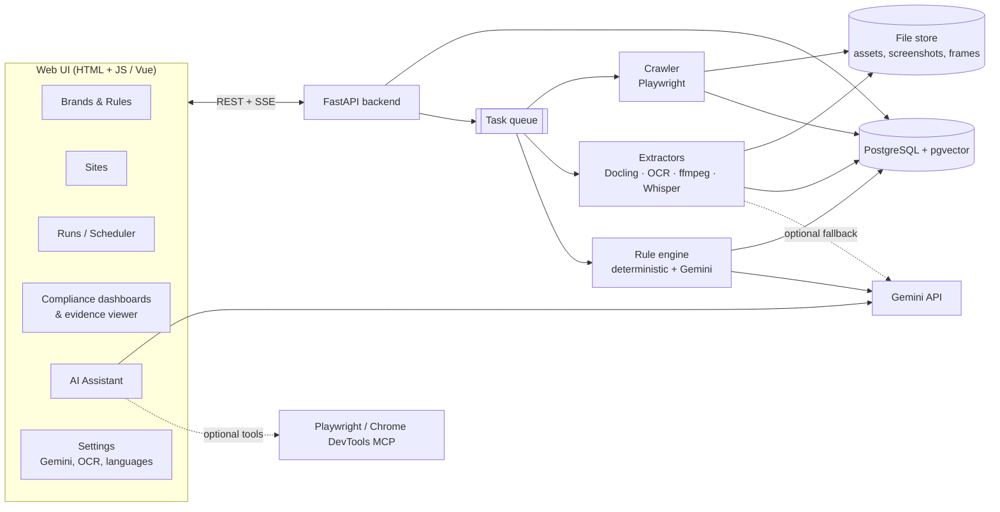

# Brand Compliance Review Platform — Solution Design (Draft v0.2)

> Status: **design iteration**, no code yet. Open questions are in [§13](#13-open-questions).

### Changes since v0.1

| Area | Decision |
|---|---|
| AI | **Google Gemini** is the primary LLM, with all its settings managed in the UI. Local Ollama is still an optional provider |
| Crawling | Compared browser MCPs (Chrome DevTools MCP, Playwright MCP) and AI-native crawlers (Crawl4AI and others). Decision: crawl with Playwright directly; give the browser MCP to the AI assistant only ([§5.1](#51-crawling--is-there-a-modern-alternative-like-chrome-mcp)) |
| Scale | Not a concern: simplified deployment (fewer services) |
| Brands | Multiple brands can be configured; the first release ships with one |
| Languages | Multilingual: English, Chinese (Simplified and Traditional), Japanese, Spanish, German, and others via config |
| Content scope | **Every kind of content**: visible text, hidden text and metadata, text inside images, documents, videos and audio (on-screen and spoken), and non-text assets (logos, images) |
| Out of scope | Third-party embeds (YouTube, social media and so on) and anything behind a login |
| Results | **No triage workflow** (no assign or approve). Results are read-only, shown in **evaluation and compliance dashboards** with drill-down and export |
| Frontend | Explained how Vue relates to plain HTML and JS ([§5.9](#59-frontend--is-vue-the-same-as-html--js)) |

---

## 1. Goal

For each configured **brand**, crawl its configured public websites and extract every asset
and every piece of text in any form. Evaluate all of it against that brand's configurable rules
(the first rule is the **brand name**, in every configured language), and present the results
in compliance dashboards.

## 2. High-level architecture



### Pipeline (per run, per site)

```
Discover ─▶ Fetch & render ─▶ Classify ─▶ Extract ─▶ Detect language ─▶ Normalize ─▶ Evaluate ─▶ Score
(sitemap,    (page, screenshot, (MIME,      (all text   (per segment)       (per-language   (rules,     (dashboards,
 links,       same-domain       scanned?,   forms, see                      normalization)  Gemini on   run diff)
 assets)      assets)           language)   §5.2)                                           ambiguous)
```

Each step is keyed by **content hash**, so re-runs only reprocess changed assets. Changing a rule
re-evaluates the stored text without crawling the sites again.

---

## 3. Configuration model

Everything is edited in the UI and can be **imported/exported as YAML**. Each run records
the config version it used.

### 3.1 Brands → Sites → Rule sets

```
Brand ─1:N─ Site
  └──1:N─ RuleSet ─1:N─ Rule
  └──1:N─ BrandTerm (canonical name + per-locale forms)
```

```yaml
brands:
  - id: acme
    name: Acme
    locales: [en, zh-Hans, zh-Hant, ja, es, de]
    terms:
      - id: product-cloud
        canonical: "AcmeCloud"                 # Latin form used in every locale unless overridden
        trademark_symbol: "®"
        localized:                             # approved local forms (optional)
          ja:      { approved: ["AcmeCloud", "アクメクラウド"] }
          zh-Hans: { approved: ["AcmeCloud", "爱克云"] }
          zh-Hant: { approved: ["AcmeCloud", "愛克雲"] }
          de:      { approved: ["AcmeCloud"], allow_compounds: true }   # "AcmeCloud-Lösung"
        disallowed: ["Acme Cloud", "Acme-Cloud", "ACMECLOUD", "Acmecloud",
                     "アクメ・クラウド", "爱克雲"]                        # mixed-script error
    rule_sets: [brand-core]
```

### 3.2 Sites

```yaml
sites:
  - id: acme-global
    brand: acme
    start_urls: [https://www.acme.com/]
    use_sitemap: true
    allowed_domains: [acme.com, cdn.acme.com]   # same-org domains only; third-party embeds are skipped
    include: ["^/(en|ja|zh-cn|zh-tw|es|de)/.*"]
    exclude: ["\\?sessionid=", "^/account/.*"]
    locale_hint_from_url: true                   # /ja/... → expect Japanese
    render_js: auto
    politeness: { rps: 2, respect_robots: true }
    schedule: "0 2 * * 1"
```

### 3.3 Rules

```yaml
rule_sets:
  - id: brand-core
    rules:
      - id: BRAND-NAME-001
        type: brand_name
        terms: [product-cloud]
        severity: high
        applies_to: [all]                  # all asset types and text sources
        text_sources: [all]                # or: visible, metadata, alt, ocr, asr, doc_props, ...
        case_sensitive: true
        fuzzy: { enabled: true, max_edit_distance: 2, min_similarity: 0.85 }   # Latin scripts
        cjk:   { char_ngram_match: true }                                     # CJK scripts
        exceptions: [urls, emails, social_handles, code]
        trademark: { require_symbol_on_first_use: true, per: asset }
        llm_review: on_ambiguous           # off | on_ambiguous | always   (uses Gemini)
```

Rule types are plugins; `brand_name` is built first. Planned later: `forbidden_terms`,
`required_text` (disclaimers), `tone_of_voice` (LLM), `logo` (visual), `color_palette`, `typography`.

---

## 4. Core data model

```
Brand ─ Site ─ Run ─ Asset ─ Segment ─ Finding ─ Rule
                       └─ parent_asset (image inside PDF, frame inside video, ...)
```

| Entity | Key fields |
|---|---|
| **Asset** | url, page_url, mime, sha256, fetched_at, storage_key, parent_asset_id, detected_languages |
| **Segment** | asset_id, text, **text_source** (see §5.2), **language**, **script**, locator, extractor + version, confidence |
| **Locator** | HTML: CSS selector + screenshot bbox · PDF/Office: page/slide + bbox · Image: bbox · Video: timestamp (+ frame bbox) · Audio: timestamp |
| **Finding** | rule_id/version, segment_id, matched_text, expected, severity, confidence, `new / persisting / fixed` vs previous run |

There is no workflow state on findings. A **suppression list** (a rule exception or an
allow-listed URL) is the only way to silence a known false positive, and it is itself config.

---

## 5. Component design & tech options

Legend: ✅ recommended · ◻ alternative · ⚠ caveat

### 5.1 Crawling — is there a modern alternative like Chrome MCP?

**Short answer:** Chrome DevTools MCP and Playwright MCP are modern and useful, but they
are the wrong tool for the **bulk crawler**. They are the right tool for the **AI assistant**.

| Option | What it is | Good for | Not good for |
|---|---|---|---|
| **Chrome DevTools MCP** (Google, Apache-2.0) | MCP server that lets an LLM drive Chrome through DevTools: navigate, inspect DOM, network, screenshots, performance | Interactive, AI-driven inspection of a single page | Crawling thousands of pages: each step costs an LLM call, so it is slow, costly and gives different results from run to run |
| **Playwright MCP** (Microsoft, Apache-2.0) | Same idea, built on Playwright, uses the accessibility tree | Same as above; works across browsers | Same as above |
| **Crawl4AI** (Apache-2.0, Python) | Modern crawler built for AI use: Playwright underneath, outputs clean Markdown, deep-crawl strategies, media and link extraction, screenshots, PDF | Fast start, text ready for LLMs, active project | Less control over the exact DOM locators and every text source we need; its Markdown output drops attributes and metadata |
| **Crawlee for Python** (Apache-2.0) | Crawling framework: request queue, retries, sessions, Playwright and HTTP crawlers | Reliable, deterministic crawling with full DOM access | More setup than Crawl4AI |
| **Firecrawl** | Crawl-to-Markdown API | Quick results | ⚠ AGPL when self-hosted; the hosted version is paid |
| **browser-use / Stagehand** | Agentic browsing frameworks | Tasks on sites that need a login or form filling | Out of scope (no login-based assets) |

**Recommendation**
- **Crawler:** ✅ **Crawlee for Python + Playwright (Chromium)**. This is the same browser engine the
  MCPs use, but it runs deterministically and without LLM cost. It gives the full DOM, computed styles,
  screenshots and network capture of every same-domain asset. ◻ Crawl4AI is a close alternative if
  we prefer less code. It is the one to use for a quick proof of concept.
- **AI assistant:** ✅ Connect **Playwright MCP** (or Chrome DevTools MCP) as a tool for Gemini, for tasks like
  *"open this page live and check whether the header still says 'Acme Cloud'"* or *"why is this page
  missing from the crawl?"*. It is used for single pages and on request, never for bulk crawling.

Crawler behaviour:
- Discovery from the sitemap and links, within `allowed_domains` only. Third-party `<iframe>`s, embeds and assets on other domains are recorded as *"skipped – out of scope"* so coverage stays visible.
- Pages behind a login, or that return 401/403, are skipped and logged.
- Pages are rendered with **CJK fonts installed** (Noto CJK) so screenshots and OCR are correct for Chinese and Japanese.
- For each page: the DOM snapshot, a full-page screenshot, and every linked or embedded same-domain file (images, SVG, PDF, Office files, video, audio, subtitle files).

### 5.2 Extraction — "all kinds of text"

Every place brand text can appear becomes a **Segment** tagged with its `text_source`:

| Asset | Text sources extracted |
|---|---|
| **Web page** | visible text (including CSS `::before/::after` content), headings, buttons, form labels and placeholders, `alt`, `title`, `aria-*`, `<meta>` description and keywords, OpenGraph and Twitter tags, JSON-LD / structured data, `<title>`, inline **SVG text**, **canvas and CSS-background text** (OCR of the screenshot), hidden or collapsed text (tabs, accordions, flagged as `hidden`), link text, URL slug and file names (reported for information only) |
| **Image** (jpg/png/webp/gif/svg) | OCR text, SVG `<text>`, EXIF/XMP/IPTC metadata (title, description, copyright) |
| **PDF** | text layer with positions; OCR for scanned pages or pages with little text; **text in embedded images**; document properties (title, author, subject, keywords); bookmarks, annotations, form-field labels |
| **Word / PowerPoint / Excel** | body, headers and footers, tables, **speaker notes**, comments, slide titles, sheet names and cell text, embedded images (OCR), document properties |
| **Video** (same-domain mp4/webm/HLS) | **spoken** transcript (speech-to-text), **on-screen text** (OCR of key frames), subtitle/caption tracks (VTT/SRT), container metadata |
| **Audio** (mp3/wav/…) | spoken transcript, ID3 metadata |

**Extraction tools**

| Need | ✅ Recommended | ◻ Alternatives |
|---|---|---|
| Web page DOM text and attributes | Playwright DOM walk (our own extractor) + `trafilatura` (main-content flag) | selectolax |
| PDF, DOCX, PPTX, XLSX | **Docling** (MIT): one consistent output with layout and positions, built-in OCR | pypdfium2 / pdfplumber (fast path); python-docx / python-pptx / openpyxl; Apache Tika |
| Legacy `.doc/.ppt/.xls` | LibreOffice headless → convert to the modern format | Tika |
| Media and metadata | `ffmpeg`/`ffprobe`, `exiftool` | `mutagen` (audio tags) |
| Video key frames | **PySceneDetect** + perceptual-hash dedupe (`imagehash`) | 1 fps sampling |
| Speech-to-text | **faster-whisper** (MIT); multilingual, auto-detects language | whisper.cpp; **Gemini audio** (see §5.4) |

### 5.3 Multilingual handling

| Concern | Approach |
|---|---|
| Language detection | ✅ **lingua-py** (Apache-2.0), per segment (a page often mixes languages); the URL locale hint gives a starting guess |
| OCR for CJK and Latin text | ✅ **RapidOCR / PaddleOCR PP-OCR multilingual models** (Apache-2.0): strong on Chinese and Japanese, CPU-friendly. ◻ **Tesseract** language packs (`chi_sim`, `chi_tra`, `jpn`, `jpn_vert`, `deu`, `spa`, `eng`, …) for clean scanned documents |
| Vertical Japanese and Chinese text | PaddleOCR handles it; Tesseract `jpn_vert` / `chi_*_vert` as fallback |
| Speech-to-text | Whisper is multilingual. Brand terms go into `initial_prompt`/hotwords per language to reduce misrecognition |
| Normalization | Unicode **NFKC** (full-width `ＡｃｍｅＣｌｏｕｄ` → `AcmeCloud`), case-folding for Latin scripts only, zero-width and soft-hyphen removal, handling of the Japanese middle dot `・` and long-vowel mark `ー`, accent-aware matching for Spanish and German (`casefold` + exact accent check) |
| Word boundaries | Latin scripts: tokens + fuzzy match with **RapidFuzz**. CJK has no spaces, so match on characters/n-grams directly; optional **jieba** (Chinese) and **SudachiPy** (Japanese) tokenizers for context. German compounds: `allow_compounds` accepts `AcmeCloud-Lösung` and flags `Acmecloudlösung` |
| Mixed scripts / variants | Detect Simplified vs Traditional mismatches (`爱克雲`) with **OpenCC** (Apache-2.0) conversion tables |
| LLM tier | Gemini is multilingual and gets the segment language plus the approved localized forms in the prompt |

### 5.4 AI layer — Google Gemini

**Provider abstraction:** `LLMProvider` → `GeminiProvider` (default) · `OllamaProvider` (optional, local).
We use the official **`google-genai` Python SDK**, which supports both **Gemini API (AI Studio key)** and
**Vertex AI** (GCP project + service account).

**Where Gemini is used**

| Use | Model tier (configurable) | When |
|---|---|---|
| **Rule judge**: ambiguous findings, LLM rule types | Flash-class (fast, cheap) | Only for `ambiguous` segments or `llm_review: always`; results cached by `(rule_version, segment_hash)` |
| **AI assistant**: chat with tool calling | Pro-class or Flash | On demand from the UI |
| **Multimodal extraction fallback** *(optional)*: read text in an image, frame, audio clip or PDF page when local OCR/speech-to-text confidence is low, or for stylized logos and wordmarks | Flash-class | Per-asset-type setting: `local` \| `local + gemini fallback` \| `gemini` |
| **Embeddings** for assistant search | Gemini embedding model (multilingual) | Indexing findings and segments |

Gemini's native multimodal input (images, PDFs, video, audio) matters here: stylized logos
and banner text that local OCR misreads can be sent to Gemini. The assets are public, so there
is no data-sensitivity problem, and the "fallback only" default keeps cost low.

**AI assistant tools** (Gemini function calling, each backed by our API):
`search_findings`, `get_compliance_stats`, `get_asset_evidence`, `explain_finding`,
`draft_rule` (returns YAML; shown in the sandbox for the user to confirm), `compare_runs`,
`summarize_run`, and optionally `browse_live_page` (Playwright/Chrome DevTools MCP).
The assistant never changes config without the user confirming in the UI.

**Gemini settings page (UI)**

| Setting | Notes |
|---|---|
| Connection mode | `Gemini API (API key)` or `Vertex AI (project, location, service-account JSON)` |
| API key / credentials | Stored **encrypted on the server** (Fernet/KMS); the UI only shows `••••1234`; never sent back to the browser |
| Model per task | Dropdowns for **Assistant**, **Rule judge**, **Multimodal extraction** and **Embeddings**, filled live from the API's list of models (so new Gemini versions show up without code changes) |
| Generation params | temperature, top-p, max output tokens, thinking budget (if the model supports it), JSON-mode on/off for the rule judge |
| Safety settings | Per-category thresholds (marketing content can falsely trip filters, so the default is relaxed) |
| Limits & budget | Requests/min, tokens/day, monthly spend cap, "pause LLM steps when cap reached" |
| Multimodal fallback | Per asset type: off / fallback below confidence X / always |
| Test connection | Sends a sample prompt and shows latency, model and token usage |
| Usage panel | Tokens and estimated cost per run, task and model |

⚠ The Gemini API **free tier** has strict rate limits, and Google may use free-tier prompts to improve its products.
That is acceptable for public content, but the paid tier or Vertex AI is recommended for predictable
throughput. Local **Ollama** stays available as a zero-cost fallback provider.

### 5.5 Rule engine

1. **Deterministic tier** (every segment): normalize per script → exact, regex and disallowed-variant match →
   fuzzy (Latin) / character n-gram (CJK) → exceptions → trademark-first-use check.
   Output: `violation` / `ok` / `ambiguous` + confidence.
   **Spoken** segments (speech-to-text) are checked for mention and pronunciation only, not spelling.
   Segments whose OCR/speech-to-text confidence is low are marked `ambiguous`.
2. **Gemini tier** (only `ambiguous` or LLM rules): returns structured JSON with
   `{verdict, reason, suggested_fix}` in the segment's language plus English.
3. **Rule sandbox (UI):** paste text, upload a file or enter a URL, then see the live results before activating a rule version.

### 5.6 Orchestration

Scale is not a concern, so the stack is kept small:
- ✅ **Celery + Valkey** (BSD) with separate queues (crawl / extract / media / rules) so slow media jobs don't block pages
- ◻ Even simpler: **Huey** or **Dramatiq** with a SQLite/Redis broker, or a **Postgres-backed queue** (e.g. `procrastinate`, MIT). This removes the Valkey container entirely; the Postgres queue is my preferred simplification
- Scheduling: cron expressions per site, run by the same worker (Celery Beat / procrastinate periodic tasks)
- Run progress is sent to the UI over **SSE**

### 5.7 Storage

- ✅ **PostgreSQL 16** + **pgvector**: config, runs, assets, segments, findings, full-text search, vectors
- ✅ **Local filesystem volume** for raw files, screenshots and key frames. Object storage is no longer needed at this scale

### 5.8 Backend

**FastAPI** + Pydantic v2 + SQLAlchemy 2 + Alembic · SSE for progress and assistant streaming ·
simple local auth (`fastapi-users`) with `admin` / `viewer` roles (no reviewer workflow).

### 5.9 Frontend — is Vue the same as HTML + JS?

**Yes, in the sense that matters:** Vue is a **JavaScript library**. You still write **HTML**
(Vue templates are HTML with a few extra attributes like `v-if`, `v-for` and `@click`), **CSS**
and **plain JavaScript**. The browser only ever runs normal HTML/CSS/JS. There is no new language, no
TypeScript requirement and no server-side runtime.

What Vue adds on top of plain JS:
- **Reactivity:** change a JS variable and the page updates. No manual `document.querySelector(...).innerHTML = ...`
- **Components:** reusable pieces such as `<FindingCard>` or `<PdfEvidence>`, each with its own HTML, JS and CSS in one file
- **Routing and state** for a multi-screen app

| Option | What you write | Build step | Fit for this UI |
|---|---|---|---|
| **Plain HTML + JS** (vanilla, maybe Web Components) | HTML files + JS + `fetch()` + DOM updates by hand | None | Workable, but dashboards, filter panels, evidence viewers and chat mean a lot of hand-written DOM code |
| **Vue 3, no build** | HTML page + `<script src="vue.js">`, templates inside the HTML | None | Good for prototypes; harder to organize as the app grows |
| ✅ **Vue 3 + Vite (plain JS)** | `.vue` files (HTML template + JS + CSS); Vite bundles them into **static HTML/JS/CSS** | `npm run build` | Best balance: still HTML + JS, but organized and reactive |
| ◻ htmx + Alpine.js | HTML returned by Python (Jinja) + small JS sprinkles | None | Simple, but weaker for interactive viewers and streaming chat |

**Recommendation:** Vue 3 + Vite in plain JavaScript, with **PrimeVue** (MIT) components.
Supporting libraries: **Apache ECharts** (dashboards), **PDF.js** (PDF evidence), **Video.js**
(jump to timestamp), **CodeMirror 6** (YAML editor), **markdown-it** (assistant replies),
**vue-i18n** (UI localization if needed).

### 5.10 Deployment

**Docker Compose** with `api`, `worker` (one image, several queues), `postgres`, optional `valkey`,
optional `ollama`, and `ui` (static files served by Caddy/Nginx). The worker image includes Chromium,
Noto CJK fonts, Tesseract language packs, ffmpeg, exiftool and LibreOffice. The GPU is optional.

---

## 6. UX design

### 6.1 Navigation

```
┌──────────────────────────────────────────────────────────────────────────────┐
│ ◆ BrandGuard  [Brand: Acme ▾]  Overview  Compliance  Explorer  Runs          │
│                               Sites  Rules  Settings                    [🤖] │
└──────────────────────────────────────────────────────────────────────────────┘
```
The **brand switcher** filters everything; with a single brand it is hidden.

### 6.2 Screens

| Screen | Purpose |
|---|---|
| **Overview** | KPI tiles: compliance score, assets evaluated, violations by severity, new vs fixed since last run, coverage (crawled / skipped / failed). Latest runs and next scheduled run |
| **Compliance dashboard** | Score trend across runs; breakdowns by **site**, **language**, **asset type**, **text source** (visible / metadata / image OCR / video spoken / on-screen, …) and **rule**; heat-map site × language; top offending pages and files; most frequent wrong variants (e.g. "Acme Cloud" ×312). Every chart drills down to a findings list |
| **Findings list** (drill-down) | Read-only grid with facets (site, language, asset type, text source, rule, severity, confidence, new/persisting/fixed); export CSV/XLSX; **click → Evidence viewer** |
| **Evidence viewer** | Left: the evidence in context (page screenshot with highlight box, PDF.js page with bbox, image with bbox, video at timestamp with transcript/on-screen text, audio with transcript). Right: matched text, expected form, rule, language, confidence, extractor, Gemini explanation (if any), link to the live URL |
| **Explorer** | Browse site → page → assets; view every extracted segment by text source and language; see skipped out-of-scope items and why |
| **Runs** | Start run (full / incremental / single URL / re-evaluate only); live pipeline progress per step; errors and logs; schedules |
| **Sites** | Add-site wizard: URL → sitemap detection → preview of discovered pages, languages and asset mix → scope → brand → schedule |
| **Rules** | Brand terms editor (canonical form, localized approved and disallowed forms per language); rule builder with form + YAML toggle; **sandbox**; versions and diff |
| **Settings** | **Gemini** (§5.4), OCR/speech-to-text engines and languages, crawl politeness, suppression list, users, data retention |
| **Assistant drawer** | Gemini chat that knows the current screen; answers link to findings and charts; can draft rules into the sandbox |

### 6.3 Compliance scoring (proposal)

- **Asset score** = 100 − weighted penalties (high = 10, medium = 3, low = 1), floor 0
- **Site / brand score** = share of evaluated assets with **no high-severity violation**, plus the weighted average asset score
- Every score can be sliced by language, asset type and text source, and compared between runs

---

## 7. Brand-name rule — multilingual example

| Source | Language | Segment | Result |
|---|---|---|---|
| HTML `<h1>` | en | "Welcome to Acme Cloud" | ❌ disallowed variant |
| HTML `alt` | en | "AcmeCloud dashboard" | ✅ |
| `og:title` | ja | "アクメ・クラウドの特長" | ❌ disallowed katakana form (expected アクメクラウド) |
| Image OCR (0.93) | zh-Hans | "爱克雲 平台" | ❌ mixed Simplified/Traditional (expected 爱克云) |
| Full-width text | ja | "ＡｃｍｅＣｌｏｕｄ" | ✅ after NFKC (optionally a low-severity note on full-width use) |
| PDF p.4 | de | "Acmecloud-Lösung" | ❌ casing |
| PDF p.4 | de | "AcmeCloud-Lösung" | ✅ allowed compound |
| DOCX properties → Title | es | "Guía de Acme Cloud" | ❌ disallowed variant (in metadata) |
| Video 00:42 spoken | es | "acme cloud" | ℹ spoken mention; spelling not checked |
| Video 01:10 on-screen | en | "ACMECLOUD" | ❌ casing |
| Banner image, stylized (OCR 0.52) | en | "AcmeCIoud" | ⚠ ambiguous → Gemini vision fallback: "AcmeCloud" ✅ |
| `youtube.com` iframe | — | — | ⏭ skipped (third-party, out of scope) |

---

## 8. Non-functional

- **Politeness:** respect robots.txt, per-domain rate limits, identifiable User-Agent; crawl only brand-owned domains.
- **Incremental:** ETag/Last-Modified + sha256; rule changes re-evaluate without re-crawling.
- **Audit:** every finding references run, config version, rule version, extractor and model version.
- **Safety:** sandboxed Chromium; file-size and decompression limits; Office macros are never executed.
- **Cost control:** Gemini only for ambiguous cases and fallbacks, caching, budget cap in Settings.

## 9. License watch-list

| Component | Issue | Mitigation |
|---|---|---|
| PyMuPDF | AGPL | Docling / pypdfium2 / pdfplumber |
| Redis ≥ 7.4 | not BSD | Valkey, or a Postgres queue |
| Firecrawl (self-hosted) | AGPL | Crawlee / Crawl4AI |
| Ultralytics YOLO | AGPL | Gemini vision / OpenCLIP for future logo rules |
| FFmpeg | LGPL/GPL by build | Run as an external CLI |
| Gemini API | Commercial service (free tier has limits and data-use terms) | Settings budget cap; Ollama fallback |

## 10. Tech stack summary

| Layer | Choice |
|---|---|
| Frontend | Vue 3 + Vite (plain JS), PrimeVue, ECharts, PDF.js, Video.js, CodeMirror |
| API | FastAPI, Pydantic, SQLAlchemy, SSE |
| Jobs | Celery + Valkey (or a Postgres queue via procrastinate) |
| Crawl | Crawlee for Python + Playwright (Chromium, Noto CJK fonts) |
| Extract | Playwright DOM walker, trafilatura, Docling, LibreOffice, exiftool, ffmpeg, PySceneDetect |
| OCR | RapidOCR/PaddleOCR (multilingual), Tesseract (+ language packs) |
| Speech-to-text | faster-whisper |
| Language | lingua-py, OpenCC, jieba, SudachiPy, RapidFuzz |
| AI | Gemini via `google-genai` (API key or Vertex AI); optional Ollama; Playwright MCP as an assistant tool |
| Data | PostgreSQL + pgvector, local file volume |
| Deploy | Docker Compose |

## 11. Proposed repository layout (later)

```
backend/app/{api,core,models}
backend/app/pipeline/{crawl,extract,lang,rules,score}
backend/app/ai/{providers/gemini.py, providers/ollama.py, assistant, tools}
backend/app/workers
frontend/            Vue 3 + Vite
config/examples/     brands.yaml, sites.yaml, rules.yaml
deploy/              docker-compose.yml
docs/
```

## 12. Roadmap

| Phase | Scope |
|---|---|
| **0 – Spike** | One site, English + Japanese pages, HTML + PDF, brand-name rule, CLI output. Also compare Crawlee and Crawl4AI side by side |
| **1 – MVP** | Brand/Site/Rule config UI, runs with progress, all web-page text sources, PDF/Office via Docling, image OCR (multilingual), compliance dashboard + evidence viewer, CSV/XLSX export, Gemini settings + rule judge |
| **2 – Media & Assistant** | Same-domain video/audio (speech-to-text + on-screen OCR + subtitles), Gemini multimodal fallback, AI assistant with tools + Playwright MCP, schedules, run diffs |
| **3 – Visual brand** | Logo, color and typography rules (Gemini vision / OpenCLIP), tone-of-voice rules |

---

## 13. Open questions

1. **Gemini access:** Gemini API key (AI Studio) or **Vertex AI** on GCP? Paid tier or free tier?
2. **"All kinds of text":** I read this as *every source of text* (visible, hidden, metadata, image, document, video and spoken) **plus** non-text brand assets such as logos later. Is that right, or should visual rules (logo, color) come earlier?
3. **Localized brand names:** do the Chinese and Japanese markets use a **local-script brand name**, or always the Latin form? Is there an official list per market?
4. **Hidden text** (collapsed tabs, `display:none`, metadata): should violations there count toward the compliance score, or only be reported?
5. **Crawler preference:** go with Crawlee (control) or Crawl4AI (speed to prototype)? Or run both in the spike and decide?
6. **Queue:** is it acceptable to drop Redis/Valkey and use a Postgres-backed queue, giving one less service?
7. **Hosting:** where will this run (laptop/VM with Docker, or GCP since Gemini/Vertex is already there)?
