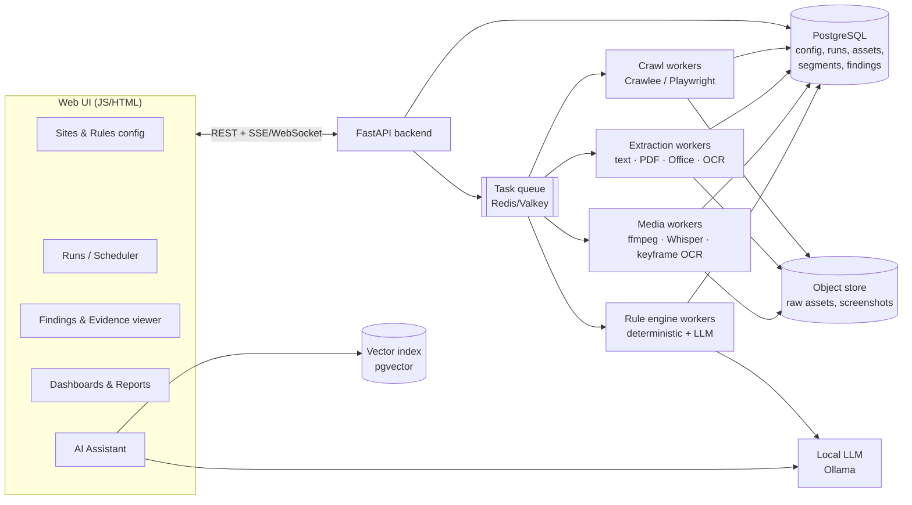

# Brand Compliance Review Platform — Solution Design (Draft v0.1)

> Status: **design iteration**, no code yet. Open questions are in [§12](#12-open-questions-for-iteration).

## 1. Goal

Automatically crawl a configured list of public websites, extract **all** content and assets
(HTML text, images, PDFs incl. scanned, Office files, video, audio, embedded data), and
evaluate every piece of content against configurable **brand-guideline rules**.
First rule: **brand name must be used correctly**.

A web UI manages the whole lifecycle: configuration → orchestration → evaluation →
findings triage → reporting, with an AI assistant built in.

**Constraints**

| Constraint | Implication |
|---|---|
| Open source / free first | Every default component is OSS with a permissive license; paid/hosted options are opt-in plugins |
| Frontend: JS + HTML | No TypeScript requirement; plain JS framework or vanilla |
| Backend: Python | Crawling, extraction, rules, API all in Python |
| Public, good-quality assets | Lightweight OCR/ASR is enough; no enterprise IDP tools |

---

## 2. High-level architecture



### Pipeline (per run)

```
Discover ─▶ Fetch ─▶ Classify ─▶ Extract ─▶ Normalize ─▶ Evaluate ─▶ Aggregate ─▶ Notify
 (sitemap,   (HTML,    (MIME,     (text,     (Segments    (rules →    (scores,     (UI, email,
  links,      render,   scanned?)  OCR, ASR)  with         Findings)   diffs vs     webhook)
  embeds)     assets)                          locators)                last run)
```

Each stage is an idempotent task keyed by **content hash**, so re-runs only reprocess
changed assets (incremental review).

---

## 3. Configuration model

Config lives in the DB (edited through the UI) and is **import/exportable as YAML** so it
can also be version-controlled in git. Every run records the exact config version it used.

### 3.1 Sites (`sites.yaml`)

```yaml
sites:
  - id: acme-main
    name: Acme Corporate
    start_urls: [https://www.acme.com/]
    use_sitemap: true
    scope:
      allowed_domains: [acme.com, cdn.acme.com]
      include: ["^/products/.*", "^/about/.*"]
      exclude: ["^/careers/apply.*", "\\?sessionid="]
      max_depth: 5
      max_pages: 5000
    render_js: auto            # auto | always | never
    asset_types: [html, image, pdf, office, video, audio]
    follow_embeds: [youtube, vimeo]   # third-party embedded media
    politeness: { rps: 2, respect_robots: true, user_agent: "AcmeBrandAudit/1.0" }
    schedule: "0 2 * * 1"      # weekly, Mon 02:00
    rule_sets: [brand-core]
    locale: en
```

### 3.2 Rules (`rules.yaml`)

```yaml
rule_sets:
  - id: brand-core
    rules:
      - id: BRAND-NAME-001
        type: brand_name
        severity: high
        applies_to: [all]                 # or [html, pdf, image, video, ...]
        canonical: "AcmeCloud"
        allowed_variants: ["AcmeCloud®", "AcmeCloud's"]
        disallowed_variants: ["Acme Cloud", "Acme-Cloud", "ACMECLOUD", "Acmecloud"]
        case_sensitive: true
        fuzzy:
          enabled: true
          max_edit_distance: 2            # catches "AcmeCluod", "AcemCloud"
          min_similarity: 0.85
        exceptions:
          - context_regex: "https?://\\S+"  # ignore URLs / emails
          - context_regex: "@acmecloud"     # social handles
        trademark:
          require_symbol_on_first_use: true
          symbol: "®"
        llm_review: on_ambiguous         # off | on_ambiguous | always
```

Rule types are **plugins** (Python classes registered by `type`). Planned types:

| Type | Example | Engine |
|---|---|---|
| `brand_name` | spelling, casing, spacing, ® usage | deterministic + fuzzy |
| `forbidden_terms` | competitor names, deprecated product names | keyword / regex |
| `required_text` | legal disclaimer on product pages / PDFs | presence check |
| `tone_of_voice` | "no superlatives without claim" | LLM |
| `visual_logo` | outdated logo, wrong logo colors (later) | image similarity / VLM |
| `color_palette` | CSS / image colors outside palette (later) | CSS parse + k-means |
| `typography` | non-approved font families (later) | computed CSS via Playwright |
| `metadata` | page title / og:site_name contains brand | DOM |

---

## 4. Core data model

```
Site ─1:N─ Run ─1:N─ Asset ─1:N─ Segment ─1:N─ Finding ─N:1─ Rule
                       │
                       └─ parent_asset (e.g. image inside PDF, frame inside video)
```

| Entity | Key fields |
|---|---|
| **Asset** | url, source_page_url, mime, sha256, size, fetched_at, http_status, storage_key, parent_asset_id, extraction_status |
| **Segment** | asset_id, text, **locator**, extractor (`dom`, `pdf-text`, `ocr`, `asr`…), confidence |
| **Locator** (JSON) | HTML: css/xpath + screenshot bbox · PDF: page + bbox · Image: bbox · Video/Audio: start–end timestamp (+ frame bbox) |
| **Finding** | rule_id, segment_id, matched_text, expected, severity, confidence, status (`open`/`confirmed`/`false_positive`/`fixed`/`waived`), assignee, comments |

The **locator** is the key UX enabler: every finding can be shown *in place* —
highlighted on the page screenshot, the PDF page, the image, or the exact second of the video.

---

## 5. Component design & tech options

Legend: ✅ recommended default · ◻ alternative · ⚠ license caveat

### 5.1 Crawling & discovery

| Need | Options |
|---|---|
| Crawl framework | ✅ **Crawlee for Python** (Apache-2.0) — queues, retries, autoscaling, Playwright + HTTP crawlers in one<br/>◻ **Scrapy** + scrapy-playwright (BSD) — very mature, bigger ecosystem |
| JS rendering | ✅ **Playwright** (Apache-2.0) with headless Chromium |
| Sitemap discovery | ✅ **ultimate-sitemap-parser** (GPL-3.0 ⚠ — fine for internal use) ◻ custom parser with `lxml` |
| robots.txt | `protego` (BSD) / built-in in Scrapy/Crawlee |
| Embedded media | ✅ **yt-dlp** (Unlicense) for YouTube/Vimeo/etc. — prefer fetching captions over downloading video |

Crawler also captures: **full-page screenshot** per page (evidence + OCR of text rendered in
canvas/CSS backgrounds), all ``/`srcset`/CSS background images, `<a href>` to documents,
`<video>/<audio>/<iframe>` sources, `alt`, `title`, `aria-label`, `<meta>`/OpenGraph, JSON-LD.

### 5.2 Content extraction

| Asset | Recommended | Alternatives |
|---|---|---|
| HTML text | ✅ Full DOM visible text via Playwright (`innerText` + attributes) **and** `trafilatura` (Apache-2.0) for main-content | `selectolax`, `BeautifulSoup` |
| PDF (digital) | ✅ **pypdfium2** (Apache/BSD) or **pdfplumber** (MIT) — text + bbox per word | PyMuPDF ⚠ AGPL; `pdfminer.six` (MIT) |
| PDF (scanned) | Detect "no text layer / low chars per page" → rasterize → OCR | **OCRmyPDF** (MPL-2.0) wraps Tesseract |
| Word/PPT/Excel | ✅ **Docling** (MIT, IBM) — unified parser for PDF/DOCX/PPTX/XLSX/HTML/images with layout + OCR | `python-docx`, `python-pptx`, `openpyxl` (MIT); **Apache Tika** (Apache-2.0, needs JVM); **Unstructured** (Apache-2.0) |
| Images in docs | Extract embedded images → treat as child assets → OCR | |
| Legacy `.doc/.ppt` | **LibreOffice headless** (MPL) convert → modern format | Tika |

> **Docling vs. per-format libraries**: Docling gives one consistent output (with page/bbox) for
> almost every document type and has OCR built in, which massively simplifies the extractor
> layer. Per-format libraries are lighter and faster. Proposal: Docling as the default,
> lightweight libraries as a fast path for plain digital PDFs.

### 5.3 OCR (images, scanned PDFs, video frames)

| Option | License | Notes |
|---|---|---|
| ✅ **RapidOCR** (PaddleOCR models on ONNX Runtime) | Apache-2.0 | Good accuracy on marketing images/stylized text, CPU-friendly, no Paddle dependency |
| ◻ **Tesseract 5** (+ `pytesseract`) | Apache-2.0 | Fast, great on clean document text, weaker on banners/stylized text |
| ◻ **PaddleOCR** | Apache-2.0 | Best accuracy, heavier install |
| ◻ **EasyOCR** | Apache-2.0 | Simple, PyTorch, slower on CPU |
| Later: **VLM** (Qwen2.5-VL / Florence-2 via Ollama or HF) | Apache/MIT | Reads logos/stylized wordmarks, describes images; much slower |

Proposal: Tesseract for scanned documents (fast), RapidOCR for web images and video frames.
Store per-word confidence; low-confidence matches get flagged as "needs human review"
rather than hard failures.

### 5.4 Video & audio

```
video ─▶ ffmpeg ─┬─▶ audio.wav ─▶ faster-whisper ─▶ transcript segments (timestamped)
                 └─▶ PySceneDetect keyframes ─▶ OCR ─▶ on-screen text segments (timestamped + bbox)
YouTube/Vimeo ─▶ yt-dlp: captions if available (skip ASR) else audio-only download
```

| Need | Recommended | Notes |
|---|---|---|
| Demux / transcode / frames | **FFmpeg** | ⚠ LGPL/GPL depending on build; used as a CLI tool, not linked |
| Speech-to-text | ✅ **faster-whisper** (MIT) — CPU int8 works; GPU optional | ◻ whisper.cpp (MIT) · ◻ Vosk (Apache-2.0, lighter, lower accuracy) |
| Keyframes | ✅ **PySceneDetect** (BSD) | ◻ fixed-interval sampling (e.g., 1 fps) + perceptual-hash dedupe (`imagehash`) |

Brand names are often mis-transcribed by ASR ("Acme Cloud" vs "AcmeCloud"), so:
use Whisper's `initial_prompt`/hotwords with the brand vocabulary, and treat **spoken**
findings differently (spoken rules = pronunciation/mention, not spelling).

### 5.5 Rule engine

Two-tier evaluation:

1. **Deterministic tier (fast, cheap, explainable)** — runs on every segment
   - Normalization: Unicode NFKC, whitespace/hyphen/zero-width char folding, ®/™ handling
   - Exact & regex matching (`regex` module), disallowed-variant list
   - Fuzzy detection with **RapidFuzz** (MIT) over token n-grams to catch misspellings
   - Context exclusions (URLs, emails, handles, code blocks)
   - Output: `violation` / `ok` / `ambiguous` with confidence
2. **LLM tier (optional, only for `ambiguous` or LLM-type rules)**
   - Prompt includes rule text, segment + surrounding context, asset type
   - Structured JSON output (verdict, reason, suggested fix)
   - Results cached by `(rule_version, segment_hash)`

Rule definitions validated with **Pydantic**; each rule is versioned; a **rule sandbox** in the UI
lets users paste text / upload a file / pick a URL and test a rule before activating it.

### 5.6 AI layer

| Need | Recommended | Alternatives |
|---|---|---|
| LLM runtime (local, free) | ✅ **Ollama** (MIT) | ◻ vLLM (Apache-2.0, GPU) · ◻ llama.cpp server |
| Models | ✅ **Qwen2.5 / Qwen3 7–14B** (Apache-2.0) · Mistral 7B/Small (Apache-2.0) | ⚠ Llama 3.x (custom community license) · hosted Claude/OpenAI as opt-in plugin |
| Vision (later) | Qwen2.5-VL (Apache-2.0), Florence-2 (MIT) | |
| Embeddings | ✅ `bge-small`/`bge-m3` or `nomic-embed-text` via Ollama/sentence-transformers | |
| Vector store | ✅ **pgvector** (PostgreSQL license) — no extra service | ◻ Qdrant (Apache-2.0), Chroma (Apache-2.0) |
| Orchestration | Thin in-house layer with LLM **tool calling** | ◻ LlamaIndex / LangChain (MIT) — heavier |

LLM access goes through a single provider interface so hosted models can be swapped in by config.

**AI Assistant capabilities** (tool-calling agent over the backend API):
- *Query*: "Which PDFs on acme-main misspell AcmeCloud since last month?" → SQL/API tool
- *Explain*: why a finding was raised, with evidence
- *Author rules*: "Flag 'Acme Cloud' with a space but ignore URLs" → proposes YAML, runs it in sandbox
- *Triage help*: suggest false positives, bulk-classify similar findings
- *Summarize*: executive summary of a run / site / trend
- *Suggest fixes*: rewritten copy that follows guidelines

### 5.7 Orchestration & scheduling

| Option | License | Fit |
|---|---|---|
| ✅ **Celery** + **Valkey/Redis** broker | BSD | Mature, simple, per-stage queues (crawl / extract / media / rules) scale independently; UI builds on our own Run/Task tables |
| ◻ **Dramatiq** / **RQ** | LGPL / BSD | Simpler than Celery, fewer features |
| ◻ **Prefect 3** | Apache-2.0 | Built-in flow UI, retries, scheduling; adds a server; its UI would duplicate ours |
| ◻ **Temporal** | MIT | Most robust durable workflows; heaviest to operate |
| Scheduler | ✅ Celery Beat or **APScheduler** (MIT) reading cron from Site config | |

⚠ Redis ≥ 7.4 is no longer BSD (RSAL/SSPL, AGPL option in 8.x) → prefer **Valkey** (BSD) as a drop-in.

### 5.8 Storage & search

| Need | Recommended | Alternatives |
|---|---|---|
| Relational + JSON + FTS + vectors | ✅ **PostgreSQL 16** (+ pgvector) | |
| Raw assets, screenshots, frames | ✅ Local filesystem / volume for MVP → **SeaweedFS** or **Garage** (S3-compatible) for scale | ⚠ MinIO (AGPL, community edition reduced) |
| Full-text search in UI | ✅ Postgres FTS | ◻ Meilisearch (MIT) / OpenSearch (Apache-2.0) if volume grows |

### 5.9 Backend API

- **FastAPI** (MIT) + **Pydantic v2** + **SQLAlchemy 2 / SQLModel** + **Alembic** migrations
- **SSE / WebSocket** for live run progress & assistant streaming
- Auth: ✅ `fastapi-users` (MIT) with local users + roles for MVP; ◻ **Keycloak** (Apache-2.0) for SSO/OIDC
- Roles: `admin` (config), `reviewer` (triage), `viewer` (read/report)

### 5.10 Frontend (JS + HTML)

| Option | Pros | Cons |
|---|---|---|
| ✅ **Vue 3 (plain JS) + Vite** + component lib (**PrimeVue**, MIT) | Rich SPA, easiest learning curve, no TypeScript needed, large component library (data tables, tree, tabs, splitter) | Build step |
| ◻ **htmx + Alpine.js** + server-rendered Jinja | Almost no JS build, very simple | Harder for complex interactive viewers (PDF/video evidence, chat) |
| ◻ **React (JS) + Vite** + Mantine/MUI | Largest ecosystem | More boilerplate |
| ◻ Vanilla JS + Web Components (Lit) | No framework lock-in | Most custom work |

Supporting libraries (all permissive): **PDF.js** (evidence highlight on PDF pages),
**Video.js** (seek-to-timestamp), **CodeMirror 6** (YAML rule editor with schema validation),
**Apache ECharts** (dashboards), **Tabulator** or PrimeVue DataTable (findings grid),
**markdown-it** (assistant responses).

### 5.11 Deployment

- **Docker Compose** for MVP: `api`, `worker-crawl`, `worker-extract`, `worker-media`, `worker-rules`,
  `beat`, `postgres`, `valkey`, `ollama`, `ui` (static via Caddy/Nginx)
- Kubernetes / Helm later; media & LLM workers optionally on a GPU node
- Observability: structured logs (JSON), **Prometheus** + **Grafana**, **OpenTelemetry** traces; Flower for Celery (optional)

---

## 6. UX design

### 6.1 Navigation

```
┌───────────────────────────────────────────────────────────────────────────────┐
│  ◆ BrandGuard      Dashboard  Sites  Rules  Runs  Findings  Reports  ⚙   [🤖]│
└───────────────────────────────────────────────────────────────────────────────┘
                                                            AI assistant drawer ─┘
```

### 6.2 Screens

| Screen | Purpose | Key interactions |
|---|---|---|
| **Dashboard** | Health at a glance | Compliance score per site, trend chart, open findings by severity/asset type, last/next runs, top recurring violations |
| **Sites** | Manage crawl targets | Add site wizard (URL → auto-detect sitemap → preview discovered pages & asset counts → scope rules → schedule), bulk import YAML/CSV, enable/disable |
| **Rules** | Author brand rules | Form-based builder for common rules (brand name: canonical, variants, fuzzy slider) **+** YAML editor toggle; **Test sandbox** (paste text / upload file / URL → live findings); versions & diff; assign rule sets to sites |
| **Runs** | Orchestration | Start run (full / incremental / single URL), live pipeline view per stage (discovered → fetched → extracted → evaluated) with counts, throughput, errors; per-task logs; retry failed; cancel; schedule calendar |
| **Findings** | Triage | Grid with facets (site, rule, severity, asset type, status, confidence, new-since-last-run); bulk actions (confirm / false positive / waive / assign); group-by "same text across N assets" |
| **Evidence viewer** | See it in context | Split view: left = rendered evidence (page screenshot w/ highlight box, PDF.js page w/ bbox, image w/ bbox, video player jumping to timestamp + transcript), right = matched text, rule, expected value, suggested fix, history, comments, link to live URL |
| **Asset explorer** | Browse everything extracted | Tree by site → page → assets; view extracted text/OCR/transcript; re-extract; exclude from future runs |
| **Reports** | Share results | Per-site / per-run report; export CSV/XLSX/PDF; diff between two runs (new / fixed / persisting) |
| **Assistant** | AI help, everywhere | Docked chat drawer, context-aware (knows current site/finding/rule on screen); answers with links to findings; "Create rule from this" and "Mark similar as FP" actions require user confirmation |
| **Settings** | Platform | Users/roles, LLM provider & model, OCR/ASR engine choice, politeness defaults, notifications (email / Slack / Teams webhooks), retention |

### 6.3 Key UX principles
- **Evidence first**: never show a finding without its in-context locator.
- **Confidence visible**: OCR/ASR/LLM-derived findings carry a confidence badge; low-confidence go to a "needs review" lane.
- **Human in the loop**: AI never changes config or statuses without explicit confirmation.
- **Incremental by default**: highlight *new* vs *persisting* vs *fixed* issues since last run.

---

## 7. Brand-name rule — worked example

Canonical `AcmeCloud`, disallowed `Acme Cloud`, fuzzy on.

| Source | Segment | Result |
|---|---|---|
| HTML `<h1>` | "Welcome to Acme Cloud" | ❌ disallowed variant (high) |
| PDF p.3 | "AcmeCloud® platform" | ✅ |
| Image OCR (conf 0.71) | "AcmeCluod" | ⚠ fuzzy match, low OCR confidence → needs review |
| Video 00:42 transcript | "acme cloud" | ℹ spoken mention — spelling rule not applied; logged as mention |
| Video 01:10 on-screen text | "ACMECLOUD" | ❌ casing (high) |
| URL `acmecloud.com/login` | — | skipped by exception |
| First body mention | "AcmeCloud" without ® | ⚠ trademark-on-first-use (medium) |

---

## 8. Non-functional considerations

- **Politeness & legality**: respect robots.txt, rate limits per domain, identifiable User-Agent;
  crawl only sites the organization owns/is authorized to audit.
- **Incrementality**: HTTP `ETag`/`Last-Modified` + sha256 dedupe → only changed assets are re-extracted/re-evaluated. Rule change → re-evaluate stored segments without re-crawling.
- **Scale target (to confirm)**: e.g. 50 sites × 5k pages × 20 assets ≈ 5M assets → horizontal workers, per-queue concurrency, object storage.
- **Determinism & audit**: every finding references run id, config version, rule version, extractor + version.
- **Security**: sandboxed headless browser, file-size limits, MIME sniffing, zip-bomb/decompression limits, no macro execution for Office files (parse only).
- **Retention**: configurable retention for raw media (videos are large); keep extracted text + thumbnails longer.

---

## 9. License watch-list (things to avoid or isolate)

| Component | Issue | Mitigation |
|---|---|---|
| PyMuPDF | AGPL-3.0 | Use pypdfium2 / pdfplumber / Docling |
| MinIO | AGPL-3.0 | SeaweedFS (Apache-2.0) / Garage (AGPL too ⚠) / filesystem |
| Redis ≥ 7.4 | RSAL/SSPL/AGPL | Valkey (BSD) |
| Ultralytics YOLO | AGPL-3.0 | Avoid for logo detection; use CLIP/OpenCLIP (MIT) or ONNX models with permissive weights |
| FFmpeg | LGPL/GPL (build-dependent) | Invoke as external CLI; use LGPL build if distributing |
| Llama models | Custom license | Default to Apache-2.0 models (Qwen, Mistral) |
| ultimate-sitemap-parser | GPL-3.0 | Fine internally; replace if distributing |

---

## 10. Proposed repository layout (for later)

```
backend/
  app/api/            FastAPI routers
  app/core/           config, db, auth
  app/models/         SQLAlchemy models
  app/pipeline/
    crawl/            Crawlee/Playwright spiders
    extract/          html, pdf, office, image_ocr, media
    rules/            engine + rule plugins (brand_name, ...)
    ai/               llm provider, assistant tools
  app/workers/        Celery tasks & queues
frontend/             Vue 3 + Vite (JS)
config/examples/      sites.yaml, rules.yaml
deploy/               docker-compose, helm
docs/
```

---

## 11. Phased roadmap

| Phase | Scope | Outcome |
|---|---|---|
| **0 – Spike** (1–2 wks) | Crawl 1 site, extract HTML + digital PDF, brand-name rule, CLI output | Validate extraction quality & rule accuracy |
| **1 – MVP** | Sites/Rules config (YAML + UI forms), Runs with live progress, HTML + PDF (incl. scanned) + images OCR + Office via Docling, Findings grid + evidence viewer, CSV export, Docker Compose | Usable by brand team |
| **2 – Media & AI** | Video/audio (ffmpeg + Whisper + keyframe OCR), YouTube embeds, LLM tier for ambiguous findings, AI assistant (query/explain/author rules), scheduling & notifications, run diffs | Full asset coverage |
| **3 – Visual brand** | Logo detection (CLIP similarity / VLM), color palette & typography rules, tone-of-voice rules, SSO, multi-tenant, scale-out on K8s | Beyond text rules |

---

## 12. Open questions for iteration

1. **Scale**: roughly how many sites, pages per site, and how often should they be reviewed?
2. **Brands**: one brand or multiple brands/sub-brands (each with its own rule set)? Multiple languages/locales?
3. **Hosting**: on-prem / VM with Docker, or a cloud (AWS/Azure/GCP)? Is a **GPU** available (affects Whisper/VLM speed)?
4. **LLM policy**: local-only (Ollama) mandatory, or are hosted LLMs (e.g. Claude) allowed as an option?
5. **Frontend preference**: Vue 3 (recommended), React, or minimal htmx/Alpine?
6. **Users & workflow**: who triages findings — do you need assignment, approvals, comments, SLA/ticket integration (Jira, ServiceNow)?
7. **Third-party embeds**: should YouTube/Vimeo/social embeds and third-party-hosted PDFs be in scope?
8. **Authenticated areas**: strictly public pages only, or also gated content (login, forms, geo/cookie walls)?
9. **Outputs**: which reports/notifications are needed (email digest, Slack/Teams, PDF report for leadership)?
10. **Visual rules timeline**: is logo/color/typography compliance needed early, or is text-first acceptable?
